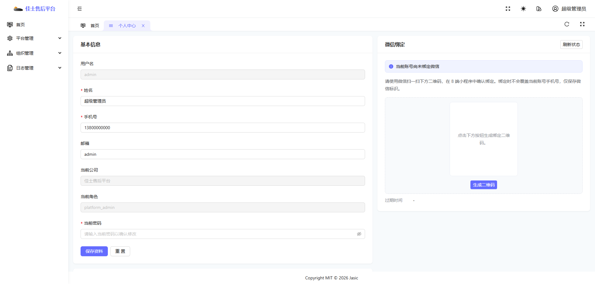
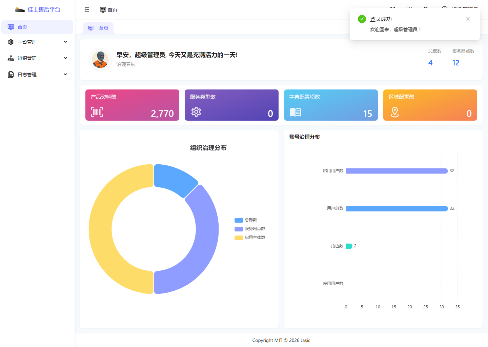
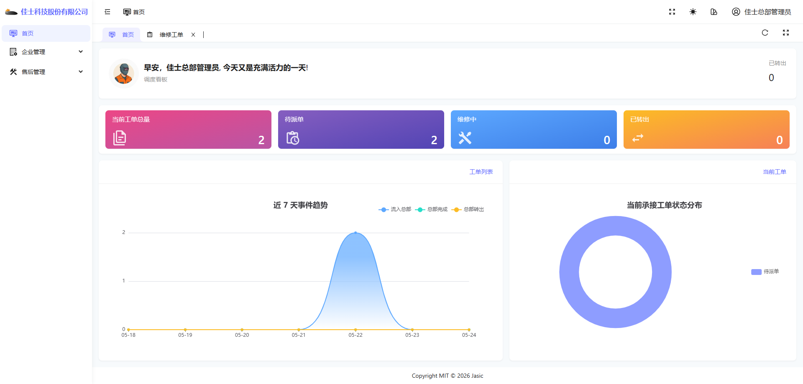
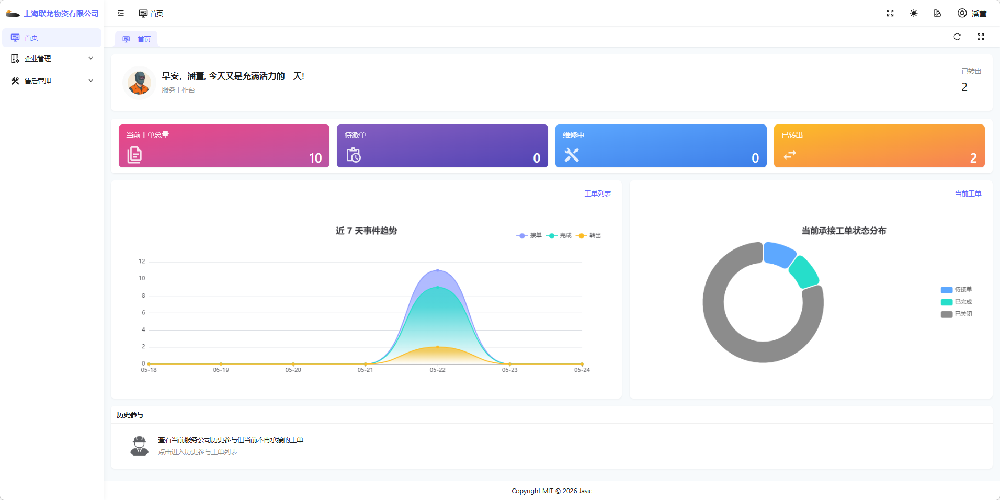
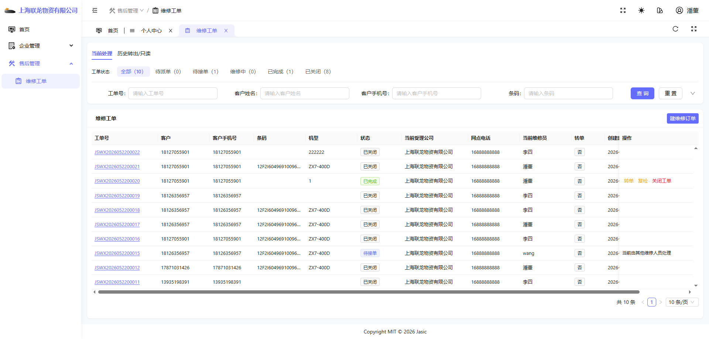

# 登录与公共说明

## 1. 适用范围

本说明适用于所有 PC 管理端角色，主要解决以下问题：

- 如何登录系统。
- 登录后首页大致长什么样。
- 工单模块里哪些区域是所有角色都会遇到的公共区域。
- 使用时应该先看哪些固定位置。

## 2. 登录入口

PC 管理端当前使用账号密码登录。

登录页截图如下：

### 操作步骤

1. 打开系统登录页。
2. 在“用户名或手机号”输入框中输入账号。
3. 在“密码”输入框中输入密码。
4. 点击“确认”按钮进入系统。

### 当前页面观察点

- 页面标题为“Jasic 佳士售后平台”。
- 当前主用登录方式为账号密码登录。
- “忘记密码”等入口当前不作为主使用流程展开。（----已隐藏）

## 3. 登录后的公共布局

无论是什么角色，登录成功后通常都会看到以下几个固定区域：

- 左侧菜单区：决定当前账号可以进入哪些模块。
- 顶部页签/面包屑区：显示当前位置。
- 主内容区：显示首页、工单、用户管理等页面内容。（----用户管理页不一定都有）
- 右上角个人区：可进入个人中心。

## 4. 个人中心

个人中心适合作为所有角色都要掌握的共性能力入口。

示意截图如下：

### 个人中心主要用途

- 查看当前账号基础信息。
- 查看当前所属公司。
- 查看当前角色。
- 修改登录密码。
- 进行微信绑定。

### 使用建议

- 首次登录后，建议先进入一次个人中心，确认“当前公司”“当前角色”是否正确。
- 如果发现自己的页面和其他账号不一致，先看个人中心里的当前角色，再判断是否为权限差异。

## 5. 首页的三种公共形态

虽然每个角色首页展示内容不同，但整体可以分成三类：

- 平台主体首页：治理看板。
- 总部主体首页：调度看板。
- 服务网点主体首页：服务工作台。

### 平台主体首页示意

### 总部主体首页示意

### 服务网点主体首页示意

## 6. 工单模块公共结构

多数业务角色最终都会进入“维修工单”页面。虽然按钮不同，但页面结构相对固定。

一级网点工单页示意如下：

### 工单页主要由四部分组成

1. 顶部页签区。
   当前常见页签为“当前处理”和“历史转出/只读”。

2. 状态统计区。
   当前常见状态包括“全部、待派单、待接单、维修中、已完成、已关闭”。

3. 查询条件区。
   常见查询项包括工单号、客户姓名、客户手机号、条码、----是否转单。

4. 列表区。
   用于展示工单号、客户、状态、当前受理公司、当前维修员、操作按钮等信息。

## 7. 当前处理 与 历史转出/只读 的区别

这两个页签需要重点理解，否则很容易误以为工单丢失。

### 当前处理

- 用来查看当前还归本账号所属公司处理的工单。
- 当前还能继续派单、接单、维修、关闭等动作的工单，通常在这里找。

### 历史转出/只读

- 用来查看当前账号所属公司曾经参与过、但当前已不再继续承接处理的工单。
- 这类工单常常只能查看，不能继续处理。

## 8. 共性排查顺序

当出现“看不到按钮”“找不到菜单”“打不开工单”等情况时，建议按以下顺序排查：

1. 先确认是否登录到了正确账号。
2. 再确认个人中心中的“当前公司”和“当前角色”。
3. 再确认左侧菜单里是否有对应模块入口。
4. 最后再确认是否是工单当前状态导致按钮不显示。

## 9. 当前环境里的共性注意事项

- 不同角色即使进入同一页面，也不一定看到相同按钮。
- 某些账号虽然能登录首页，但不一定能进入工单模块。
- 某些按钮是否出现，不只取决于角色，也取决于工单当前状态和当前处理方是否为本公司/本人。

更细的差异说明请继续查看各角色手册，以及 [10-常见异常、FAQ 与权限差异.md](./10-常见异常、FAQ 与权限差异.md)。
