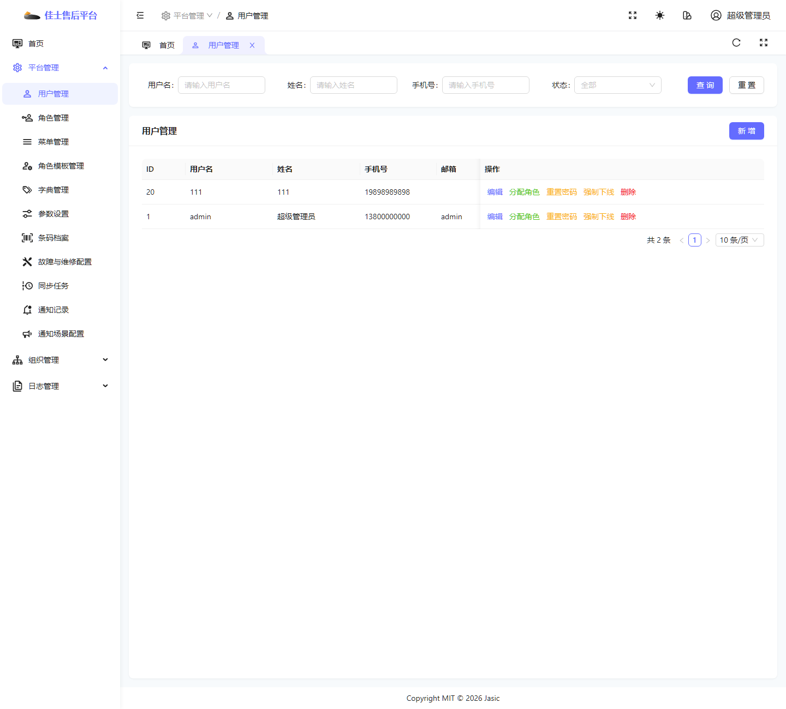
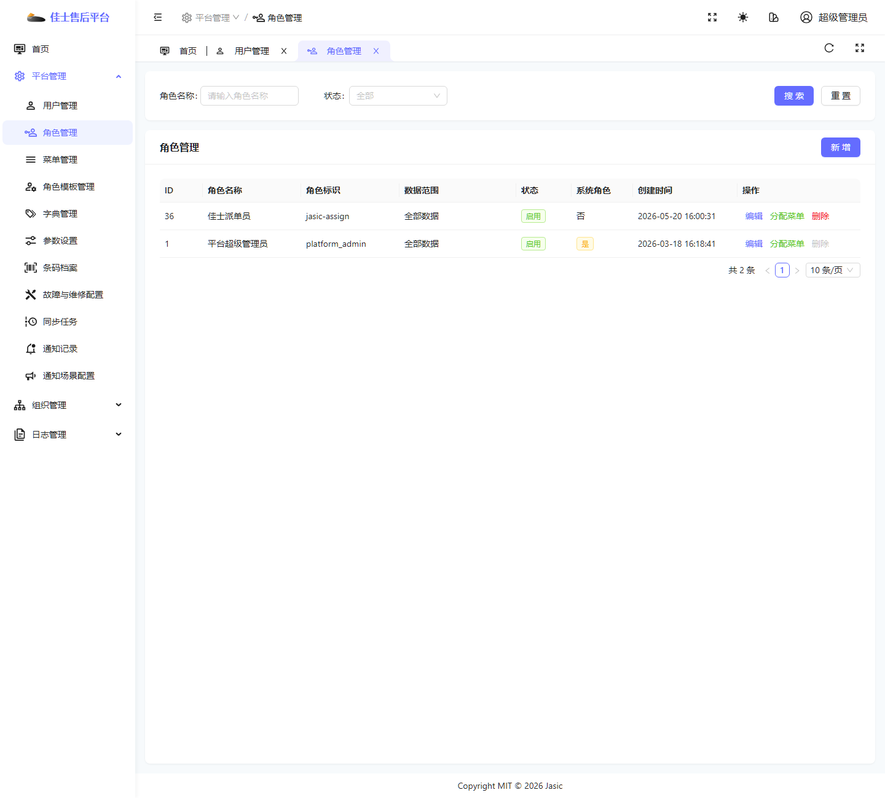
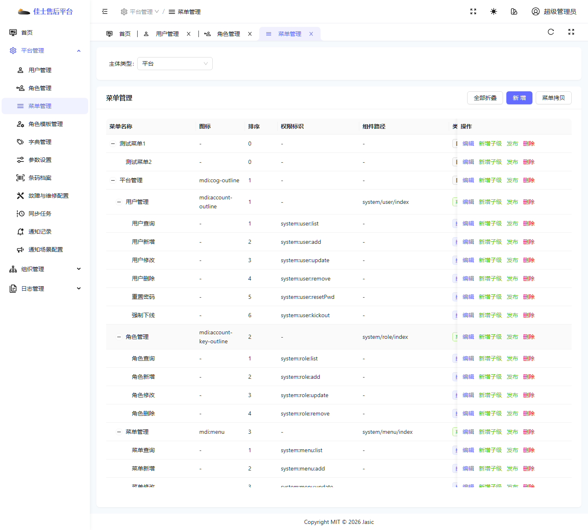
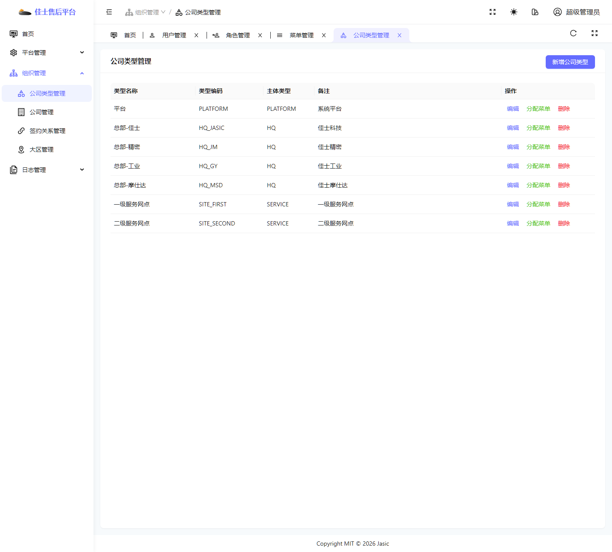
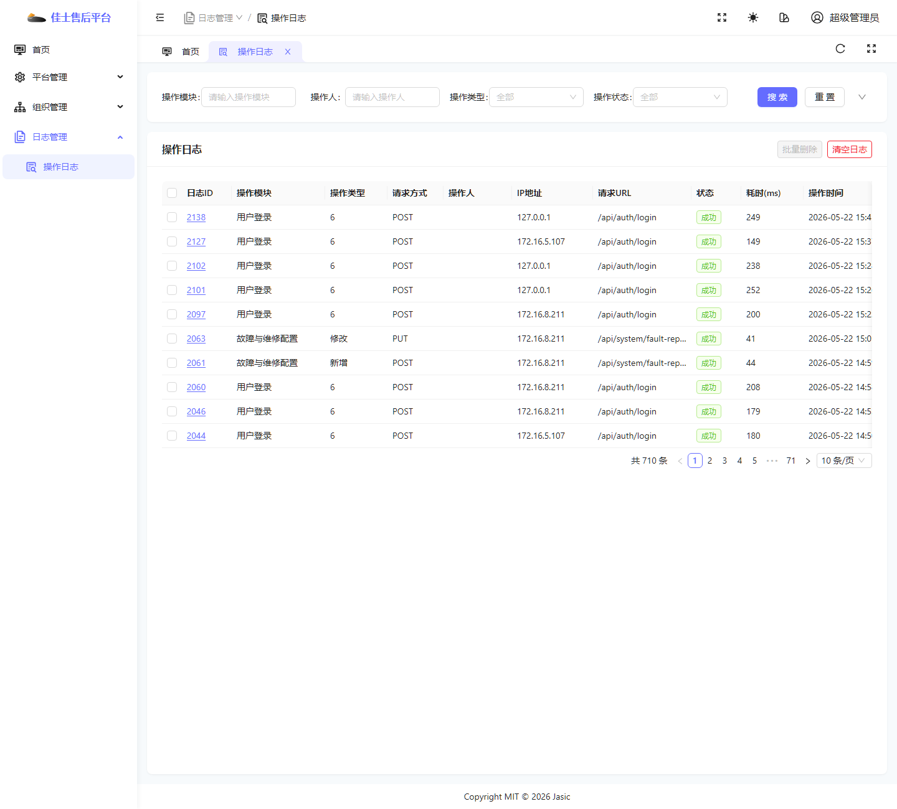

# 平台管理员操作手册

## 1. 适用对象

适用于平台管理员账号。

当前环境示例账号首页截图如下：

## 2. 当前角色定位

平台管理员更偏“平台治理”和“基础配置维护”，不以工单业务处理为核心。

从当前环境的实际菜单看，平台管理员主要能看到：

- 首页
- 平台管理
- 组织管理
- 日志管理

## 3. 首页：治理看板

首页名称为“治理看板”。

### 首页主要关注什么

- 总部数量
- 服务网点数量
- 产品资料数量
- 服务类型数量
- 字典配置项数量
- 区域配置数量
- 账号治理分布

### 使用要点

- 平台首页主要看“整体治理情况”，不是拿来处理单个工单的。
- 如果平台侧用户问“为什么首页没有工单派单按钮”，这属于正常设计，不是异常。

## 4. 用户管理

页面截图如下：

### 进入方式

1. 登录平台管理员账号。
2. 在左侧进入“平台管理”。
3. 点击“用户管理”。

### 页面主要用途

- 查看用户列表。
- 按用户名、姓名、手机号、状态筛选用户。
- 新增用户。
- 管理已有用户信息。

### 使用建议

- 重点关注“怎么找用户、怎么判断用户状态是否正常”。
- 如果涉及新增用户、修改角色、重置密码等敏感操作，建议先确认审批要求和操作边界。

## 5. 角色管理

页面截图如下：

### 页面主要用途

- 查看系统角色。
- 新增角色。
- 维护角色名称、角色标识、数据范围、状态。

### 使用要点

- 角色管理影响的是“谁能看到什么、能做什么”。
- 角色名称是给业务人员理解用的，角色标识更偏系统配置。
- 变更角色前，应先确认影响范围，避免误伤大量账号。

## 6. 菜单管理

页面截图如下：

### 页面主要用途

- 维护菜单树结构。
- 配置菜单图标、排序、权限标识、组件路径、类型、可见性、状态。

### 使用要点

- 菜单不等于功能权限，但菜单缺失会直接影响页面入口可达性。
- 当用户反馈“我明明有权限，但左边没有菜单”时，要同时排查角色权限和菜单授权。

## 7. 组织管理

当前截图示例如下：

### 页面主要用途

- 维护公司类型。
- 维护公司主体。
- 维护签约关系。
- 维护大区信息。

### 使用要点

- 组织管理决定主体边界。
- 平台、总部、服务网点的角色视图差异，本质上都和组织主体有关。

## 8. 操作日志

页面截图如下：

### 页面主要用途

- 按操作模块、操作人、操作类型、状态筛选日志。
- 查看操作记录。
- 批量删除日志。
- 清空日志。

### 使用要点

- 当业务方反馈“系统刚刚出错了”，平台管理员可先从操作日志定位是谁在什么时间做了什么动作。
- 日志清理是高风险动作，执行前应明确哪些人可以操作、什么情况下可以操作。

## 9. 平台管理员不应作为主讲内容的页面

当前路由里虽然存在部分前端页面，但并不是所有页面都适合作为平台管理员的主要使用页面。

当前整理建议：

- 以首页、用户管理、角色管理、菜单管理、组织管理、操作日志为主。
- 对未稳定暴露或当前不可达的页面，本版手册暂不展开。

## 10. 平台管理员常见使用场景

### 场景一：排查某个账号为什么进不了页面

1. 先到“用户管理”确认账号是否存在、状态是否启用。
2. 再到“角色管理”确认该账号被分配了什么角色。
3. 如有需要，再到“菜单管理”确认该角色关联菜单是否齐全。
4. 如果仍无法定位，再到“操作日志”查看最近登录或操作失败记录。

### 场景二：解释为什么不同人看到的菜单不一样

1. 先讲组织主体的差异。
2. 再讲角色差异。
3. 最后再讲菜单授权差异。

## 11. 当前环境提醒

- 平台管理员当前首页是治理看板，不是工单工作台。
- 平台管理员重点应放在“治理”“配置”“排查”，不应误解为“日常工单处理角色”。
