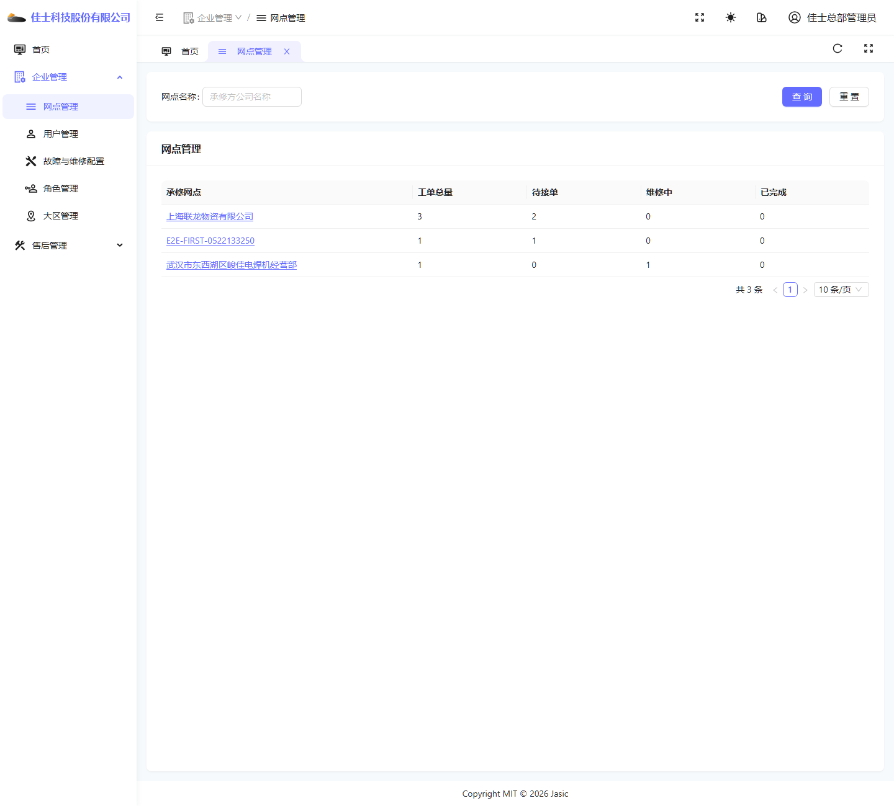
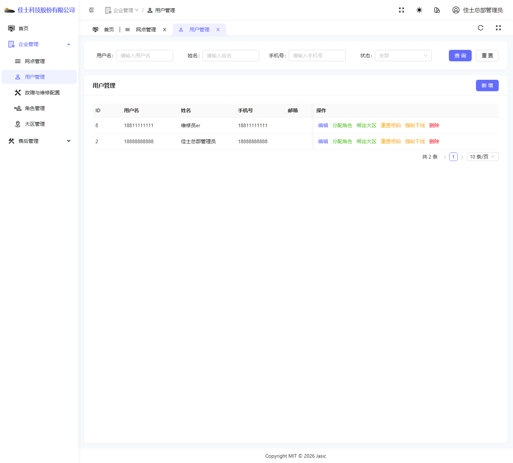
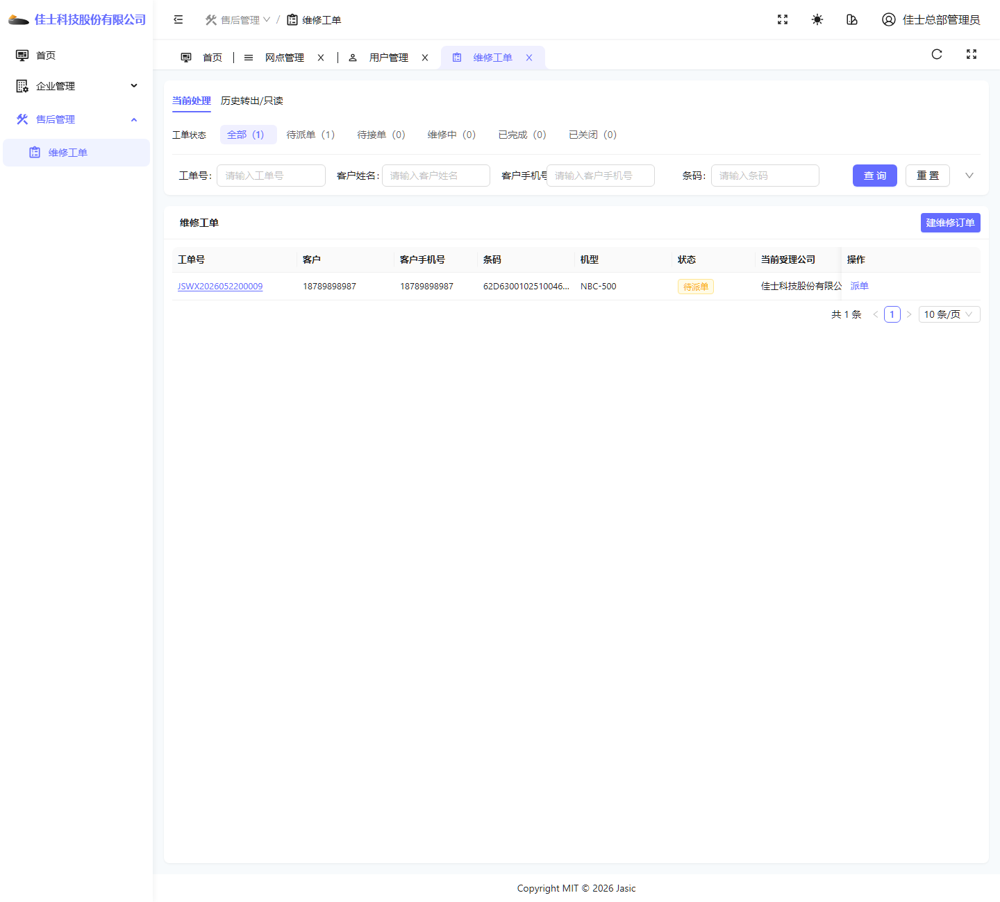

# 总部管理员操作手册

## 1. 适用对象

适用于总部管理员账号。

首页截图如下：

## 2. 当前角色定位

总部管理员在当前环境中主要承担两类职责：

- 通过首页和工单页查看总部当前承接工单池。
- 查看网点、用户、工单等与总部业务协同相关的数据。

当前环境下可见菜单主要包括：

- 首页
- 企业管理
- 售后管理

展开后可见的典型页面包括：

- 网点管理
- 用户管理
- 维修工单

## 3. 首页：调度看板

首页标题为“调度看板”。

### 首页可见重点指标

- 已转出
- 当前工单总量
- 待派单
- 维修中

### 使用要点

- 总部首页核心是看“总部当前承接的工单情况”。
- 不要把总部首页理解成平台治理页，也不要把它理解成网点个人待办页。

## 4. 网点管理

页面截图如下：

### 进入方式

1. 登录总部管理员账号。
2. 在左侧进入“企业管理”。
3. 点击“网点管理”。

### 页面主要用途

- 查看网点列表。
- 关注各承修网点的工单数量。
- 从网点维度了解总部下属或关联服务网点的承接情况。

### 使用要点

- 网点管理更适合做“协同查看”和“管理观察”。
- 这里更偏管理视角，不是实际维修处理入口。

## 5. 用户管理

页面截图如下：

### 页面主要用途

- 查看总部侧可管理的用户。
- 按常用字段筛选用户。
- 进行新增和维护。

### 使用要点

- 总部管理员使用用户管理时，要特别注意当前数据范围是总部上下文。
- 即使页面名称同为“用户管理”，和平台管理员看到的数据范围并不完全相同。

## 6. 维修工单

页面截图如下：

### 当前可见公共区域

- “当前处理”“历史转出/只读”页签。
- 状态统计区。
- 查询条件区。
- 列表区。

### 当前可见主要按钮

- 查询
- 重置
- 建维修订单
- 列表行内“派单”

### 使用要点

- 总部管理员当前可以看到建单和派单能力。
- 列表中的操作按钮是否显示，还会受工单状态影响。

## 7. 总部管理员常见操作路径

### 场景一：查看总部当前待派单工单

1. 进入“维修工单”页面。
2. 在状态统计区点击“待派单”，或直接在列表中查看状态为“待派单”的记录。
3. 根据工单号、客户手机号等条件继续筛选。

### 场景二：对待派单工单执行派单

1. 在工单列表中找到状态为“待派单”的工单。
2. 点击行内“派单”按钮。
3. 在派单弹窗中选择维修员。
4. 点击“确定”完成派单。

### 场景三：查看历史转出/只读工单

1. 进入工单页。
2. 切换到“历史转出/只读”页签。
3. 查看当前总部曾参与但已不再继续承接的工单。

## 8. 特别说明的边界

- 总部管理员能查看和派单，不代表总部下所有业务动作都在总部账号上完成。
- 很多后续维修动作仍会下沉到具体服务网点或维修员角色。
- 如果运营人员只需要看整体协调情况，不必强行讲太深的维修登记细节。

## 9. 当前环境提醒

- 当前环境下，总部管理员的工单页存在明确的派单入口。
- 总部管理员和总部维修员在同一主体下的可见能力差异很大，不能混为“总部角色”统一理解。
