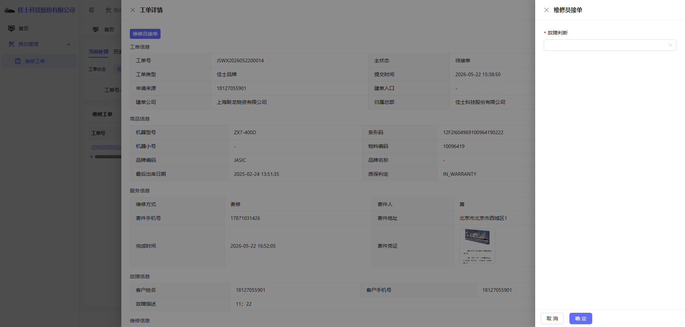
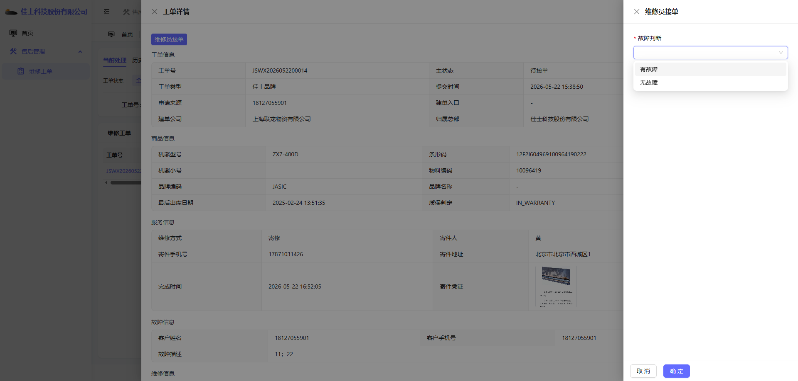
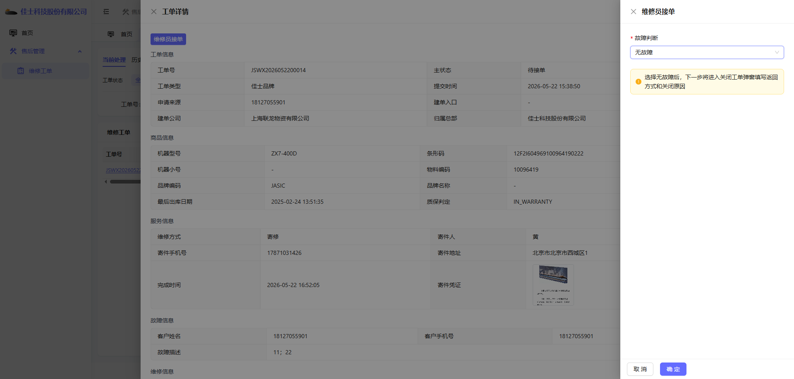
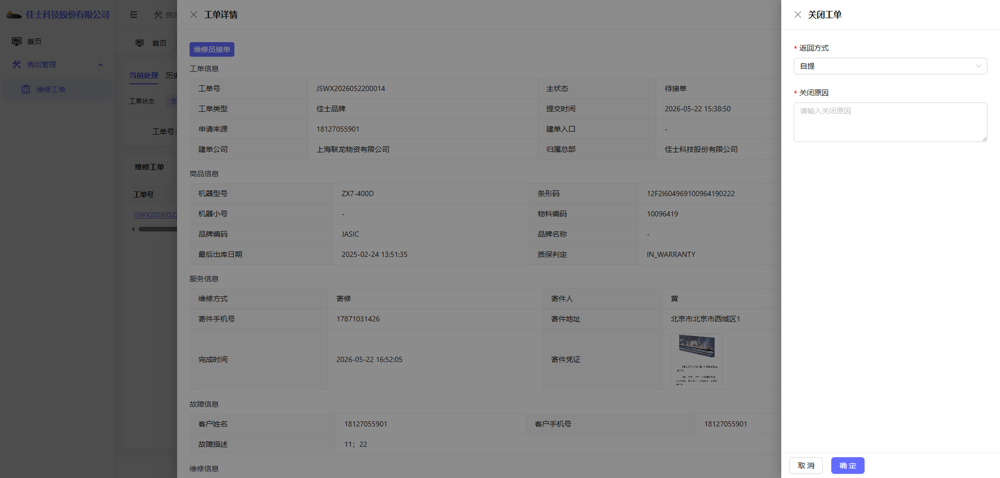
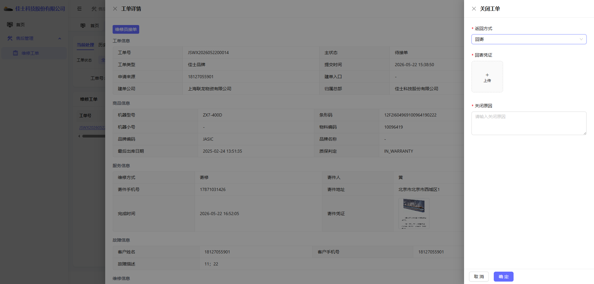

# 总部维修员操作手册

## 1. 适用对象

适用于总部维修员账号。

首页截图如下：

## 2. 当前角色定位

总部维修员账号是当前环境里最适合讲“接单、判断、关闭工单”主链路的角色。

当前可见菜单包括：

- 首页
- 售后管理
- 维修工单

## 3. 首页观察

首页使用重点不在指标本身，而在于：

- 如何从首页进入工单处理。
- 如何区分当前工单与历史参与工单。

## 4. 当前环境中的工单模块表现

当前环境下，总部维修员进入工单模块后的截图如下：

### 当前可见特点

- 有查询、重置按钮。
- 当前环境里还能看到“建维修订单”按钮。
- 当工单派给本人后，会出现“维修员接单”按钮。

### 注意事项

当前环境里该账号除了维修处理，还能看到建单按钮。这一现状和很多人对“维修员角色”的直觉不完全一致，需要明确区分。

## 5. 典型操作场景一：查看已派给自己的工单

查询截图如下：

### 操作步骤

1. 进入“维修工单”页面。
2. 在查询区输入客户手机号或工单号。
3. 点击“查询”。
4. 在列表中确认目标工单的当前维修员是否为本人。
5. 若状态为“待接单”，即可进入接单动作。

## 6. 典型操作场景二：维修员接单

### 6.1 打开接单弹窗

点击“维修员接单”后，页面会展示右侧接单抽屉：

### 6.2 选择故障判断

当前环境里的可选项包括：

- 有故障
- 无故障

选项截图如下：

本次样例选择“无故障”：

### 操作步骤

1. 点击“维修员接单”。
2. 在“故障判断”中选择实际判断结果。
3. 点击“确定”进入下一步。

## 7. 典型操作场景三：无故障关闭工单

### 7.1 进入关闭工单抽屉

当故障判断选择“无故障”后，当前会进入关闭工单步骤：

### 7.2 填写关闭信息

当前样例使用“自提”作为返回方式，并补充关闭原因：

当前样例选择了“机器返回方式”作为返回方式，并补充回寄凭证和关闭原因：

### 操作步骤

1. 在返回方式中选择实际处理方式。
2. 在关闭原因中填写清楚关闭理由。
3. 点击“确定”提交。

### 7.3 关闭成功后的结果

关闭成功后，工单状态会变成“已关闭”

从详情中还能看到：

- 故障判定为“无故障”。
- 返回方式为“自提”。
- 关闭原因被完整记录。
- 流转历史中记录了“维修员接单”“报价”“选择返回方式”“关闭工单”等动作。

## 8. 需要特别理解的业务点

### 为什么无故障也会出现“报价”记录

从当前环境的详情记录可以看到，即使本次最终走的是“无故障关闭”，系统流转历史里仍会记录“报价”动作。

不应把它理解成“必须真的录入了金额报价”，更适合按下面方式理解：

- 这是当前系统状态流中的一个技术/业务动作记录点。
- 实际要不要录维修金额，要以页面是否要求填写为准。

### 为什么关闭后列表不再出现处理按钮

因为工单主状态已经变成“已关闭”，不再属于待处理状态。

## 9. 当前环境提醒

- 总部维修员当前是最适合演示“接单 -> 无故障关闭”主链路的角色。
- 如果当前账号用于总部维修处理，这份手册可作为重点参考。
