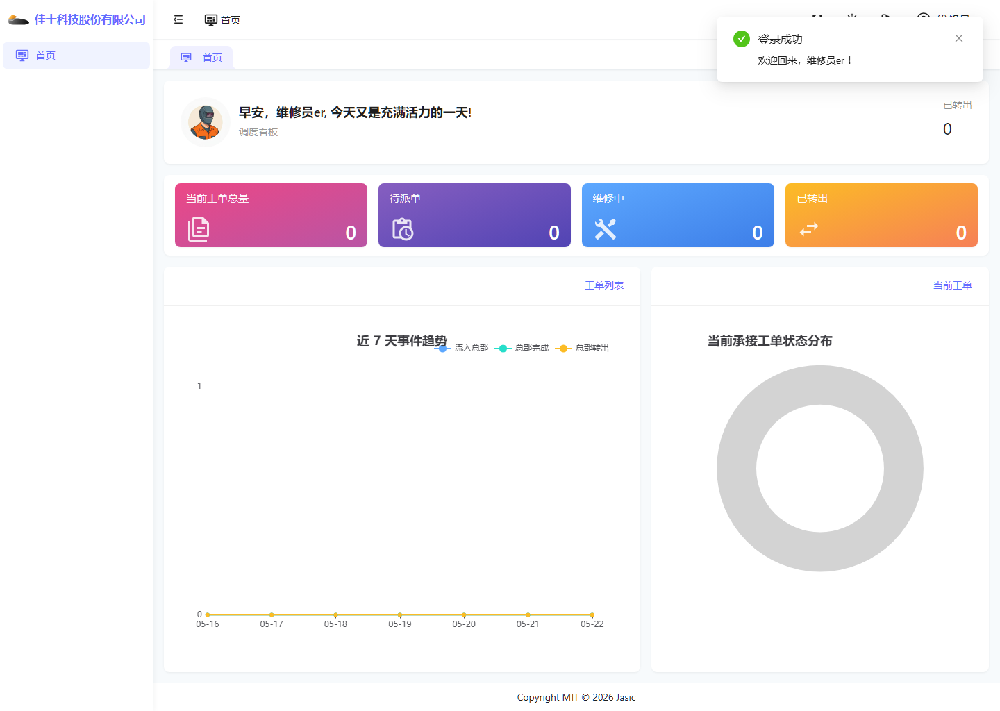

# 总部维修员操作手册

## 1. 适用对象

适用于总部维修员账号。

首页截图如下：

## 2. 当前角色定位

从当前运行环境看，总部维修员账号的可见能力明显弱于总部管理员。

当前实际看到的左侧菜单几乎只有：

- 首页

这意味着总部维修员当前更像“受限查看角色”，而不是完整的工单处理角色。

## 3. 首页观察

虽然当前首页仍展示“调度看板”样式，但需要注意：

- 首页上能看到部分工单统计信息。
- 这不代表一定具备进入工单模块并继续处理工单的权限。

需要特别注意：

“首页看到数据” 和 “具备业务页处理权限” 不是一回事。

## 4. 当前环境中的工单模块表现

当前环境下，总部维修员进入工单模块后的截图如下：

### 当前实际表现

- 页面没有正常进入工单列表。
- 页面只显示“返回首页”。

### 说明

这类现象通常说明：

- 账号本身能登录。
- 首页可见。
- 但工单模块菜单或页面层权限不完整，导致无法正常进入业务页。

## 5. 这类账号的使用说明

对于总部维修员账号，当前不应按“完整工单处理账号”理解。

当前更合适的理解方式是：

- 先看当前角色在现环境下的可见范围。
- 如果需要实际进入工单处理，应联系管理员确认角色和菜单配置。
- 不要直接套用总部管理员的操作手册。

## 6. 当前环境提示

1. 当前账号可登录系统并查看首页。
2. 当前账号暂未具备完整工单模块入口。
3. 如果业务上确实需要处理工单，应由管理员补齐对应角色权限和菜单配置。

## 7. 当前环境提醒

- 本账号现状更适合作为“权限差异案例”讲解。
- 可结合截图理解“为什么有些账号能看首页却打不开工单模块”。
- 相关异常归因和排查思路，详见 [10-常见异常、FAQ 与权限差异.md](./10-常见异常、FAQ 与权限差异.md)。
