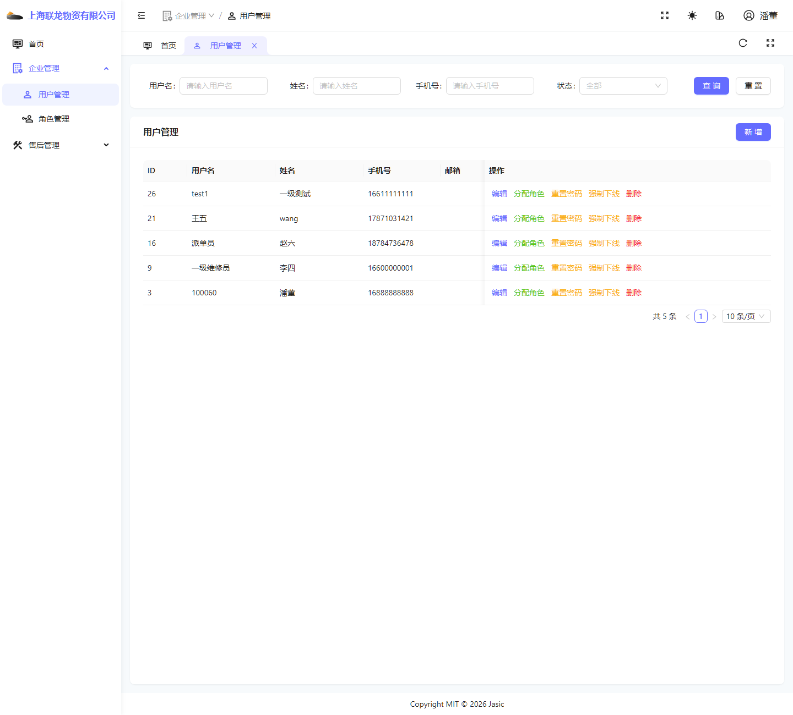
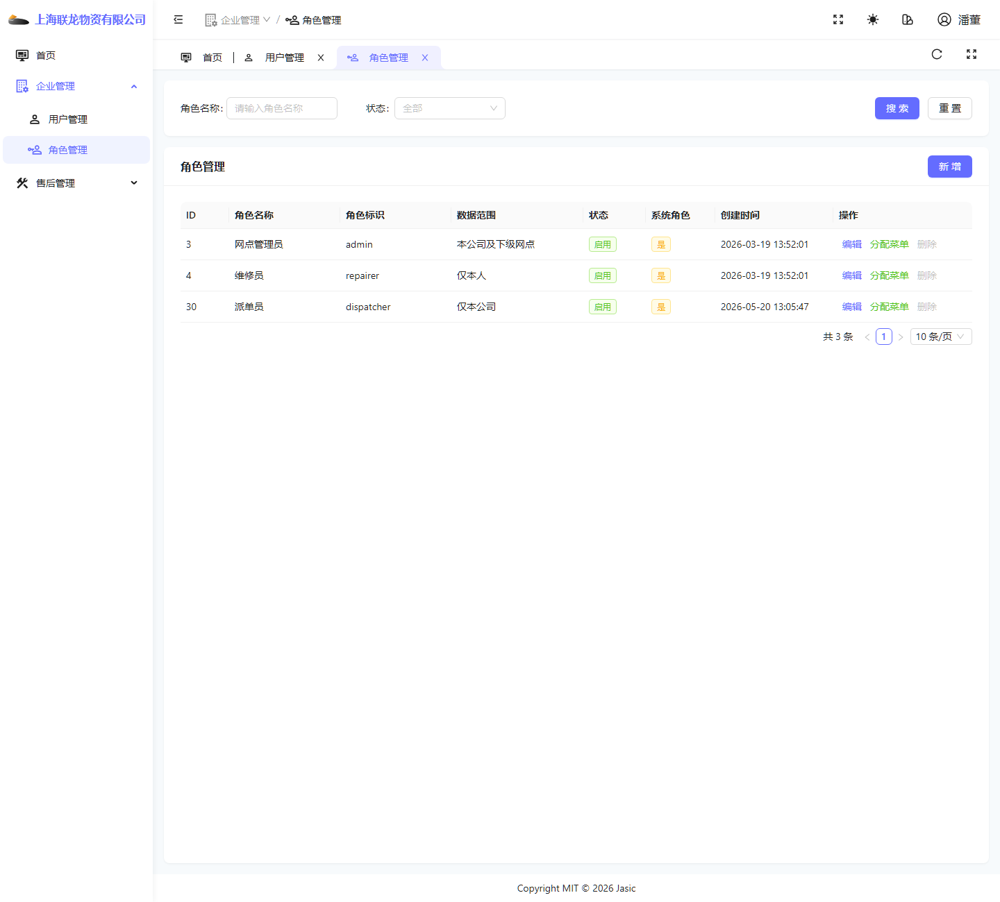
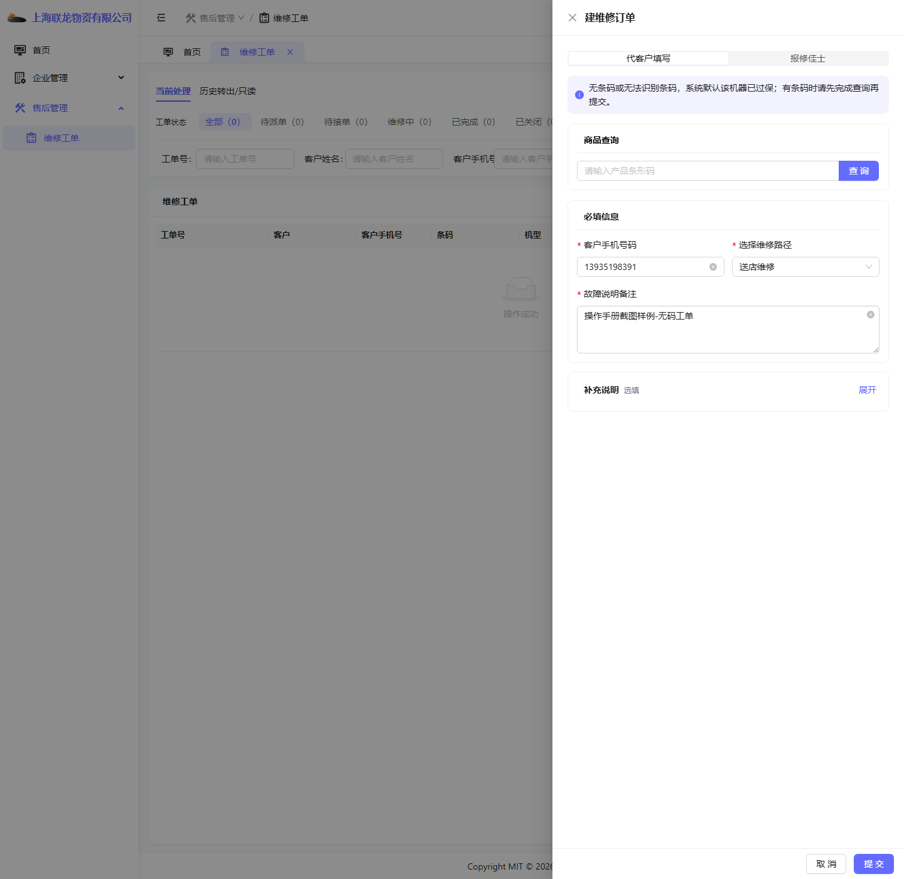
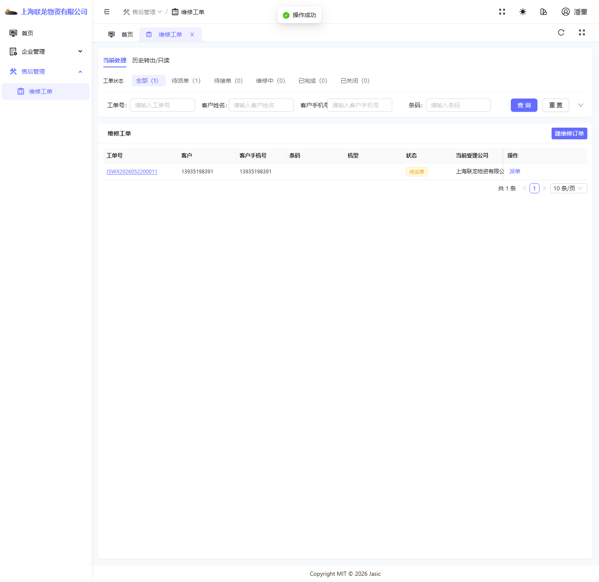
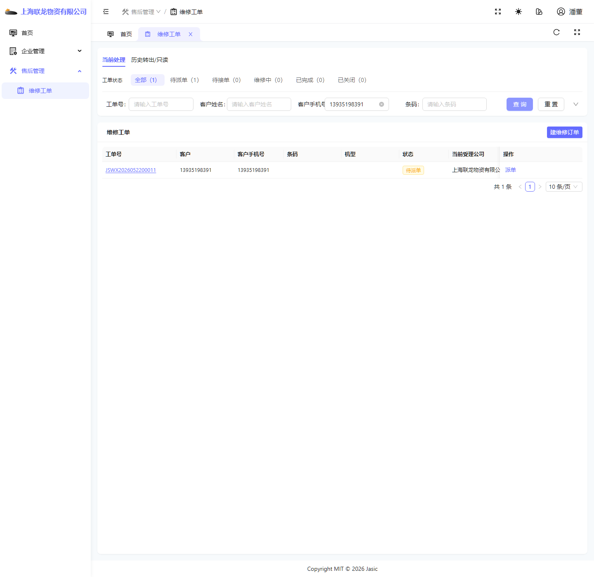
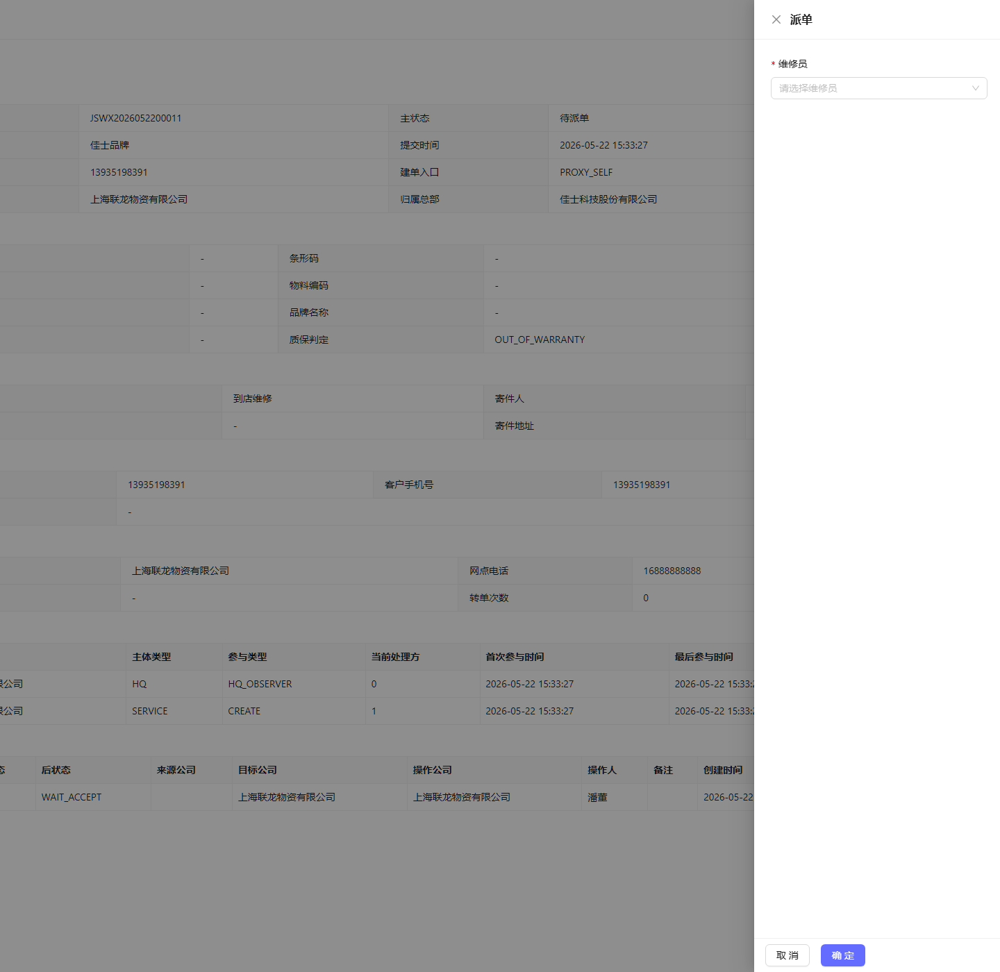
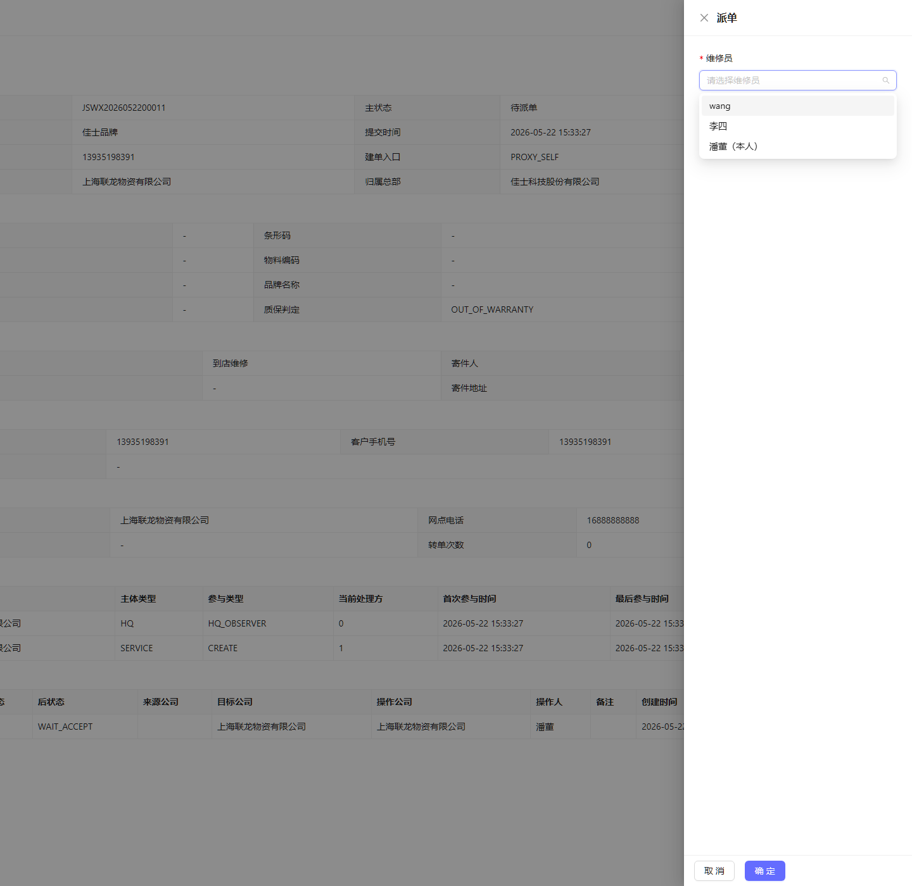
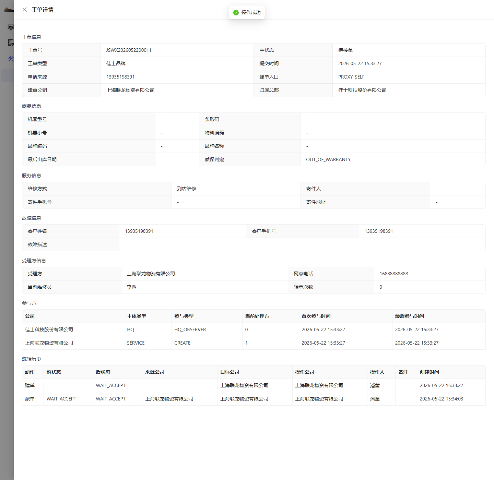

# 一级服务网点管理员操作手册

## 1. 适用对象

适用于一级服务网点管理员账号。

首页截图如下：

## 2. 当前角色定位

一级服务网点管理员是当前环境里比较典型的“既能管理、又能直接参与工单业务”的角色。

当前可见菜单主要包括：

- 首页
- 企业管理
- 售后管理

展开后当前可见的典型页面包括：

- 用户管理
- 角色管理
- 维修工单

## 3. 首页：服务工作台

首页标题为“服务工作台”。

### 首页主要看什么

- 已转出
- 当前工单总量
- 待派单
- 维修中
- 历史参与入口

### 使用要点

- 这里是网点视角的工作台，不是平台治理页，也不是总部总览页。
- “历史参与”入口很重要，建议单独理解一次。

## 4. 用户管理

页面截图如下：

### 页面主要用途

- 查看网点下的用户。
- 新增用户。
- 管理用户状态、基础信息等。

### 使用要点

- 一级网点管理员通常承担本公司账号维护职责。
- 新增账号后，是否能正常看到菜单，不仅取决于账号创建成功，还取决于角色模板、菜单授权是否完整。

## 5. 角色管理

页面截图如下：

### 页面主要用途

- 查看当前网点可用角色。
- 维护角色信息。

### 使用要点

- 当一线人员反馈“我登录后没有菜单”，一级网点管理员需要优先排查角色问题。
- 角色是否存在、状态是否正常、角色下菜单是否齐全，这三件事要一起看。

## 6. 维修工单页总览

工单页截图如下：

### 当前可见主要按钮

- 查询
- 重置
- 建维修订单
- 行内派单按钮

### 当前可见主要页签

- 当前处理
- 历史转出/只读

## 7. 典型操作场景一：创建无码工单

### 7.1 打开建单弹窗

点击“建维修订单”后，当前页面会弹出建单界面：

### 7.2 填写建单信息

当前环境下，最小可操作路径可先按无码工单演示。

填写示意如下：

### 操作步骤

1. 进入“维修工单”页面。
2. 点击“建维修订单”。
3. 默认使用“代客户填写”入口。
4. 输入客户手机号码。
5. 输入故障说明备注。
6. 点击“提交”。

### 7.3 处理无码确认框

当未填写条码时，系统会给出确认提示：

### 说明

- 当前文案明确提示：未填写产品条形码时，将按无码工单直接提交。
- 这类工单通常按“过保无码”路径处理。

### 7.4 建单成功后的结果

建单成功后，列表中会出现待派单工单：

## 8. 典型操作场景二：查询工单并准备派单

查询示意如下：

### 操作步骤

1. 在查询区输入客户手机号、工单号等条件。
2. 点击“查询”。
3. 确认目标工单状态为“待派单”。
4. 再执行派单动作。

## 9. 典型操作场景三：派单给维修员

### 9.1 打开派单弹窗

点击行内“派单”后，当前会先打开工单详情并在右侧进入派单抽屉：

### 9.2 选择维修员

当前环境里可选维修员示例如下：

### 操作步骤

1. 在工单列表中找到待派单工单。
2. 点击“派单”。
3. 在“维修员”下拉框里选择具体维修员。
4. 点击“确定”完成派单。

### 9.3 派单成功后的结果

派单成功后，工单状态会从“待派单”变成“待接单”：

### 说明

- 派单成功后，当前维修员字段会被带出。
- 当前账号如果不是被派单的维修员，列表操作区会转为只读提示，不会继续出现维修员接单按钮。

## 10. 一级网点管理员的主要使用场景

这个角色适合作为“完整业务流入口”理解：

- 如何建单。
- 如何查单。
- 如何派单。
- 如何看历史参与。
- 如何排查网点下用户和角色问题。

## 11. 当前环境提醒

- 一级网点管理员当前具备完整建单和派单演示价值。
- 如果一线岗位账号缺按钮，可先用本角色完成示范，再说明权限差异。
