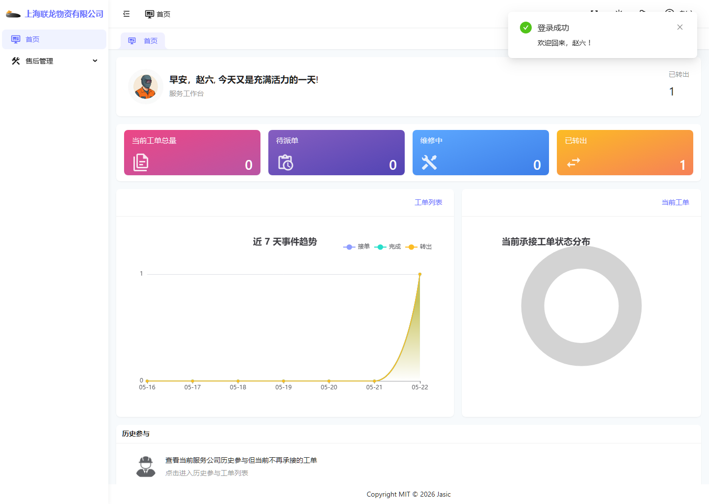

# 一级服务网点派单员操作手册

## 1. 适用对象

适用于一级服务网点派单员账号。

首页截图如下：

## 2. 当前角色定位

从角色命名理解，派单员本应偏向工单分配与协调。

但必须强调：本手册按当前环境实际表现编写，不按角色名称想当然推断。

当前环境下，该账号主要可见：

- 首页
- 售后管理
- 维修工单

## 3. 首页：服务工作台

首页截图与一般服务网点视图一致，但菜单更少：

- 没有企业管理入口。
- 更聚焦售后业务入口。

可将它理解成“轻量业务岗首页”。

## 4. 维修工单页实际表现

工单页截图如下：

### 当前实际可见按钮

- 查询
- 重置

### 当前实际未看到的按钮

- 建维修订单

这是当前环境下非常重要的现状。

## 5. 当前环境下的使用说明

由于当前页面上未看到“建维修订单”按钮，因此建议如下：

- 当前先以“查询与查看工单”为主使用。
- 如需演示建单和派单，可参考网点管理员手册。
- 不要直接假设“派单员一定能建单”，以免和当前页面表现冲突。

## 6. 本角色当前可讲的操作

### 场景一：查询工单

1. 进入“维修工单”页面。
2. 在查询区按工单号、客户姓名、客户手机号、条码输入条件。
3. 点击“查询”。
4. 在列表中查看目标工单。

### 场景二：查看当前处理与历史转出/只读

1. 在页面顶部切换“当前处理”“历史转出/只读”。
2. 对比两类工单的可见范围。
3. 重点理解“工单是否还在本公司当前承接范围内”。

## 7. 当前环境提醒

- 当前账号名称虽然是“派单员”，但当前页面并未看到建单按钮。
- 如果实际业务上需要执行建单或派单动作，应先由管理员确认账号权限配置是否完整。
- 当前账号看到的内容比管理员更少，属于正常现象。

## 8. 当前环境提醒

- 本角色当前更适合作为“权限差异说明案例”。
- 如果后续权限调整后页面发生变化，应同步更新本手册。
