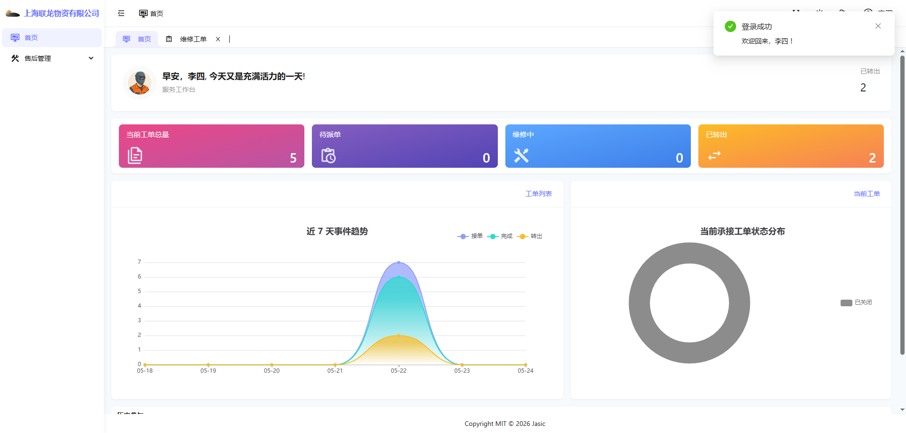
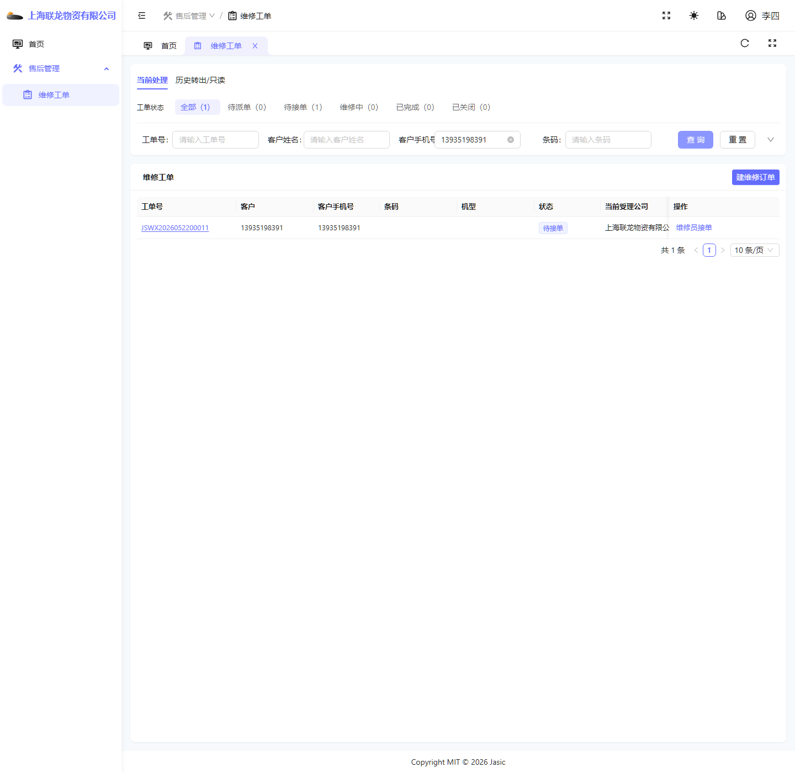
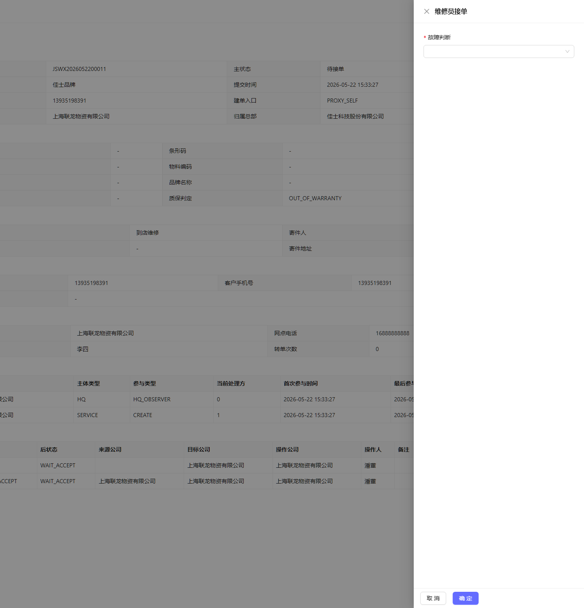
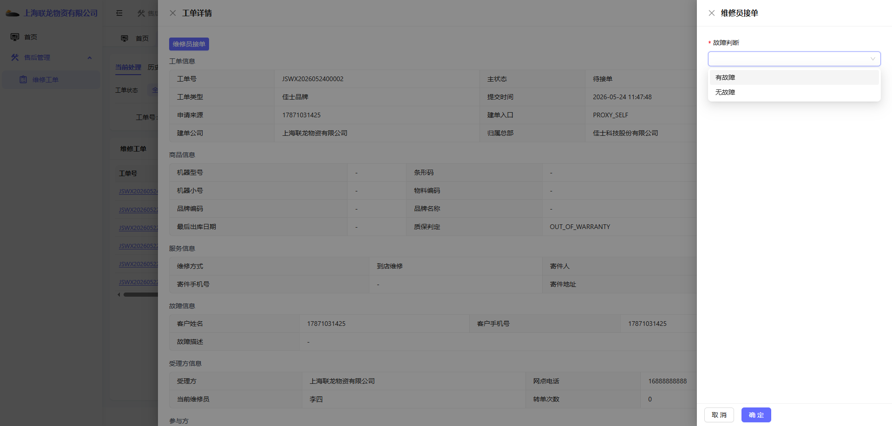
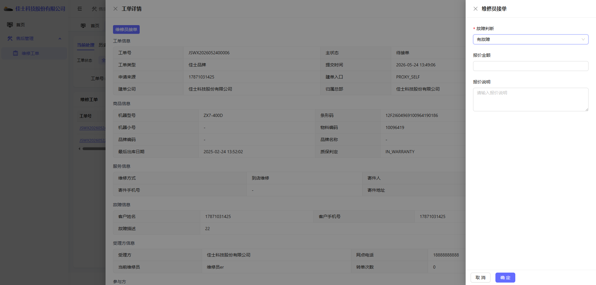
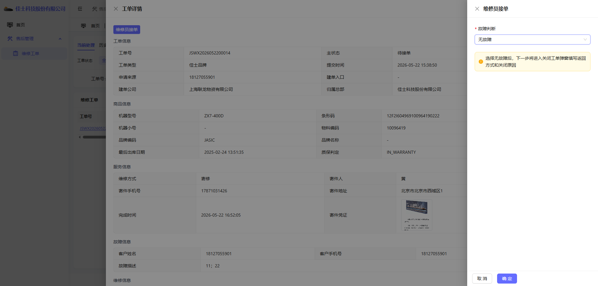
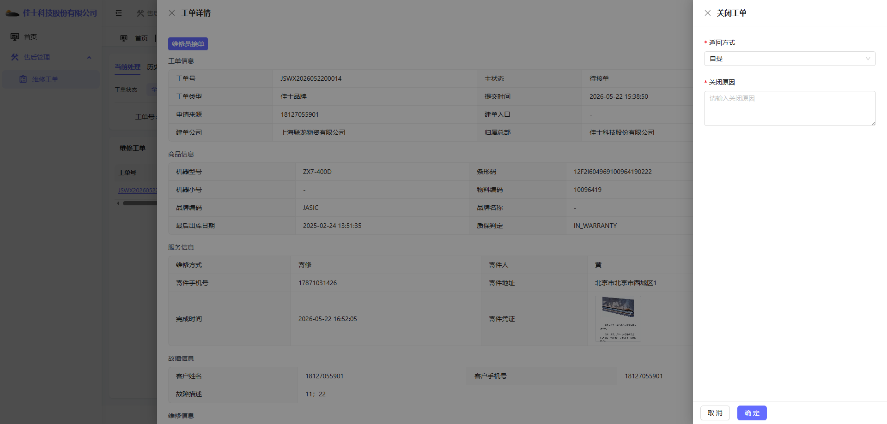
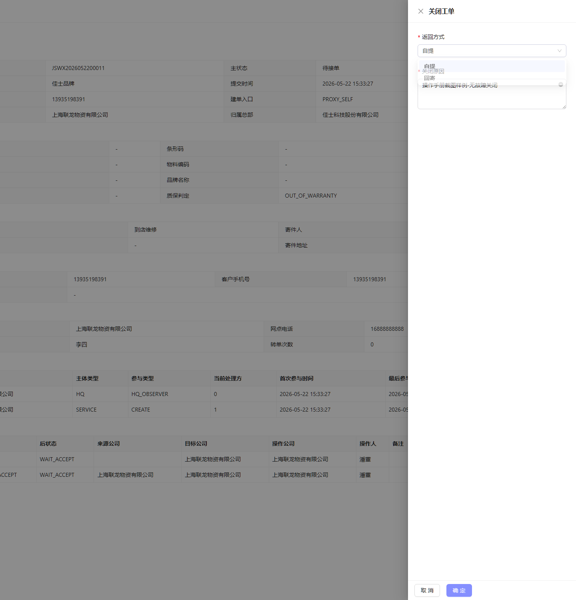
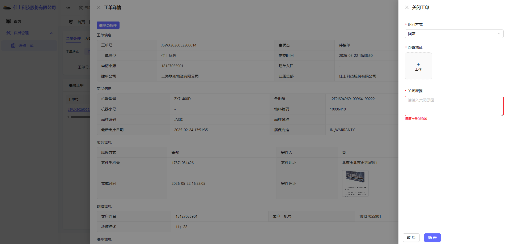
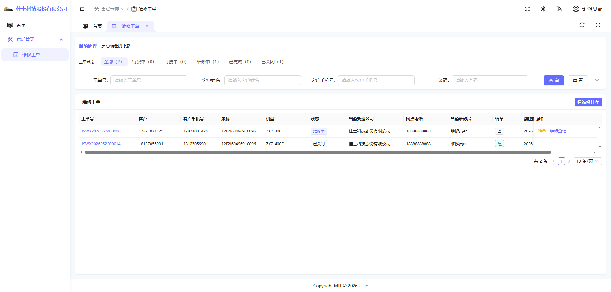

# 一级服务网点维修员操作手册

## 1. 适用对象

适用于一级服务网点维修员账号。

首页截图如下：

## 2. 当前角色定位

一级网点维修员账号是当前环境里最适合讲「接单、判断、维修登记、关闭工单」主链路的网点侧角色之一。

当前可见菜单包括：

- 首页
- 售后管理
- 维修工单

按维修员模板默认能力，一级网点维修员通常可以：

- 查询并查看派给本人的工单。
- 对待接单工单执行「维修员接单」。
- 在「有故障」分支下继续执行「维修登记」。
- 在「无故障」分支下，于接单流程内直接完成关闭。

一级网点维修员默认不具备派单、转单、复检、独立关闭已完成工单等管理动作；这些通常由一级网点管理员承担。

## 3. 首页：服务工作台

维修员首页和其他服务网点角色同属「服务工作台」。

首页使用重点不在指标本身，而在于：

- 如何从首页进入工单处理。
- 如何区分当前工单与历史参与工单。

## 4. 当前环境中的工单模块表现

当前环境下，一级网点维修员进入工单模块后的截图如下：

### 当前可见特点

- 有查询、重置按钮。
- 当前环境里还能看到「建维修订单」按钮。
- 当工单派给本人后，会出现「维修员接单」按钮。

### 注意事项

当前环境里该账号除了维修处理，还能看到建单按钮。这一现状和很多人对「维修员角色」的直觉不完全一致，需要明确区分；是否具备建单能力以账号实际权限为准。

## 5. 典型操作场景一：查看已派给自己的工单

查询截图如下：

### 操作步骤

1. 进入「维修工单」页面。
2. 在查询区输入客户手机号或工单号。
3. 点击「查询」。
4. 在列表中确认目标工单的当前维修员是否为本人。
5. 若状态为「待接单」，即可进入接单动作。

## 6. 典型操作场景二：维修员接单

「维修员接单」不是单一结果动作，而是会根据「故障判断」分成两条后续路径：

- 判定为「无故障」：接单与关闭工单在同一次流程里完成。
- 判定为「有故障」：接单后工单进入「维修中」，需继续执行「维修登记」。

### 6.1 打开接单抽屉

点击「维修员接单」后，页面会展示右侧接单抽屉：

### 6.2 选择故障判断

当前环境里的可选项包括：

- 有故障
- 无故障

选项截图如下：

选择「有故障」后，抽屉内还会额外展示：

- 报价金额（选填）
- 报价说明（选填）

本次样例选择「有故障」（页面组件与总部维修员一致，下列截图为同一套接单抽屉示意）：

选择「无故障」后，页面会提示：下一步将进入关闭工单弹窗填写返回方式和关闭原因。

本次样例选择「无故障」：

### 6.3 分支一：判定为无故障并完成关闭

当故障判断选择「无故障」并点击「确定」后，系统不会立刻结束流程，而是自动打开「关闭工单」抽屉。

关闭工单抽屉截图如下：

#### 填写关闭信息

返回方式当前可选：

- 自提
- 回寄

若选择「自提」，主要填写关闭原因即可。当前样例如下：

若选择「回寄」，还需要上传回寄凭证，并补充关闭原因：

#### 操作步骤

1. 点击「维修员接单」。
2. 在「故障判断」中选择「无故障」。
3. 点击「确定」，进入关闭工单抽屉。
4. 在「返回方式」中选择实际处理方式。
5. 若选择「回寄」，上传回寄凭证。
6. 在「关闭原因」中填写清楚关闭理由。
7. 点击「确定」提交。

#### 关闭成功后的结果

关闭成功后，工单状态会变成「已关闭」。

从详情中还能看到：

- 故障判定为「无故障」。
- 返回方式、关闭原因被完整记录。
- 流转历史中记录了「维修员接单」「报价」「选择返回方式」「关闭工单」等动作。

### 6.4 分支二：判定为有故障并进入维修中

当故障判断选择「有故障」并点击「确定」后，系统会直接完成接单，不再弹出关闭工单抽屉。

#### 接单后的页面变化

接单成功后，列表中该工单通常会出现以下变化：

- 工单状态从「待接单」变为「维修中」。
- 「维修员接单」按钮消失。
- 出现「维修登记」按钮。

接单后的列表截图如下（页面组件与总部维修员一致）：

#### 操作步骤

1. 点击「维修员接单」。
2. 在「故障判断」中选择「有故障」。
3. 如有需要，可补充报价金额和报价说明。
4. 点击「确定」完成接单。
5. 返回列表确认工单状态已变为「维修中」。

#### 当前需要理解的边界

- 「有故障」接单只代表确认进入维修处理，不会在这一步直接关闭工单。
- 接单时填写的报价信息会写入工单，后续维修登记时仍可继续补充或调整。
- 一级网点维修员在这一分支下，下一步动作就是「维修登记」，而不是关闭工单。

## 7. 典型操作场景三：有故障后的维修登记

本节承接上一节 6.4 分支。只有工单状态已经是「维修中」，且当前维修员仍是本人时，才会出现「维修登记」按钮。

### 7.1 打开维修登记抽屉

在列表或详情中点击「维修登记」后，页面会展示右侧维修登记抽屉。

维修登记抽屉截图如下（页面组件与总部维修员一致）：

当前抽屉内常见字段包括：

- 报价金额
- 报价说明
- 维修确认故障（若当前归属总部已配置故障维修项）
- 维修说明
- 其他维修说明
- 更换配件
- 故障处旧图片 / 故障处新图片 / 机器正面照片

若当前工单所属总部尚未配置对应机型的故障维修项，页面会退化为只需填写「维修说明」「更换配件」等基础字段。

### 7.2 佳士品牌机型的补录前置

若工单属于佳士品牌，且当前还没有机器型号，点击「维修登记」时系统不会直接进入最终表单，而是先弹出「补录机型」要求。

页面会明确提示：

- 佳士品牌工单在维修登记或复检前，必须先补录机器型号。
- 补录后不可再次修改。

补录机型抽屉截图如下（页面组件与总部维修员一致）：

#### 操作步骤

1. 在「补录机型」抽屉中选择机器型号。
2. 点击「确定」完成补录。
3. 系统刷新详情后，会自动继续打开「维修登记」抽屉。

若当前归属总部未配置启用机型，页面会提示先维护「故障与维修配置」，此时无法继续登记。

### 7.3 填写维修登记信息

进入维修登记抽屉后，按页面实际展示填写即可。

当前代码里的关键校验口径如下：

- 「更换配件」至少填写一条有效明细。
- 若存在故障维修配置，需选择「维修确认故障」和「维修说明」。
- 若选择了「其它故障」或「其它维修说明」，对应说明字段必填。
- 若无故障维修配置，则「维修说明」为必填。

#### 操作步骤

1. 确认工单状态为「维修中」，且当前维修员是本人。
2. 点击「维修登记」。
3. 若弹出「补录机型」，先完成机型补录。
4. 填写报价、故障项、维修说明、配件和图片等实际信息。
5. 点击「确定」提交。

### 7.4 登记成功后的结果

维修登记成功后，工单状态会从「维修中」变为「已完成」。

此时一级网点维修员侧通常会出现以下表现：

- 「维修登记」按钮消失。
- 列表可能显示只读提示，例如「当前工单已完成，待复检或关闭」。
- 后续「复检登记」「关闭工单」通常需要一级网点管理员等有管理权限的账号继续处理。

从详情中通常还能看到：

- 故障判定为「有故障」。
- 维修登记时填写的报价、故障项、配件和图片被完整记录。
- 流转历史中记录了「维修员接单」「报价」「维修登记」等动作。

## 8. 需要特别理解的业务点

### 为什么无故障也会出现「报价」记录

从当前环境的详情记录可以看到，即使本次最终走的是「无故障关闭」，系统流转历史里仍会记录「报价」动作。

不应把它理解成「必须真的录入了金额报价」，更适合按下面方式理解：

- 这是当前系统状态流中的一个技术/业务动作记录点。
- 实际要不要录维修金额，要以页面是否要求填写为准。

### 为什么「有故障」和「无故障」的关闭方式不同

- 「无故障」是在接单流程里直接合并提交关闭信息，因此维修员本人就能结束工单。
- 「有故障」需要先完成维修登记，把工单推进到「已完成」，再由有管理权限的账号执行复检或关闭。

### 为什么关闭后或登记后列表不再出现处理按钮

- 无故障关闭后，工单主状态已经变成「已关闭」，不再属于待处理状态。
- 有故障维修登记后，工单主状态变成「已完成」，维修员默认动作已结束，后续处理责任转到管理岗。

### 为什么有时能看到「建维修订单」

当前环境里，一级网点维修员账号除了维修处理，还可能看到建单按钮。这不代表所有维修员岗位都应承担建单职责，实际以当前账号权限为准。

## 9. 当前环境提醒

- 一级网点维修员当前最适合演示两条主链路：
  - 「接单 → 无故障 → 关闭工单」
  - 「接单 → 有故障 → 维修登记 → 已完成」
- 若当前账号进入工单模块后只看到「返回首页」，优先排查角色菜单和 `workorder:list` 等权限是否完整，详见 [10-常见异常、FAQ 与权限差异.md](./10-常见异常、FAQ 与权限差异.md)。
- 第 6.4、7.1–7.2 节中部分截图暂用总部维修员环境录制（同一套页面组件）；后续可替换为一级网点账号专属截图。
- 如果当前账号用于一线维修处理，这份手册可作为重点参考。
