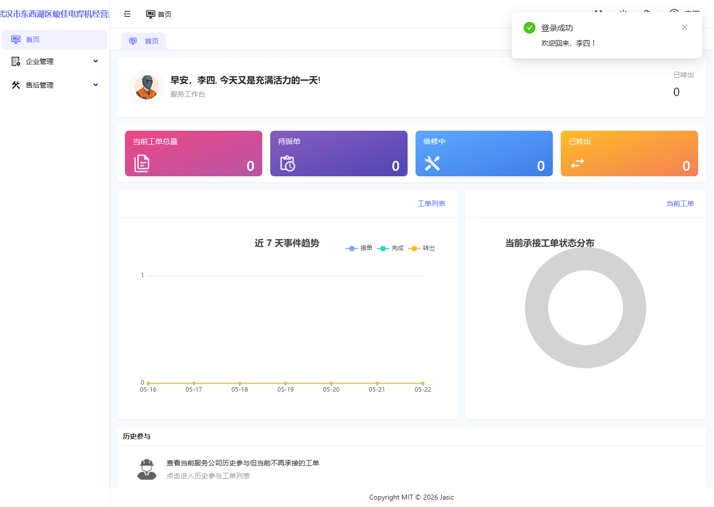
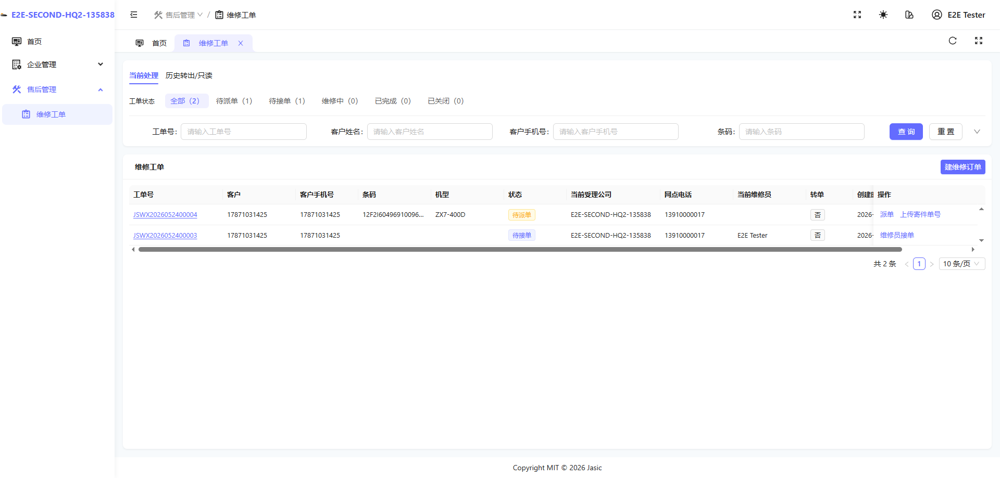
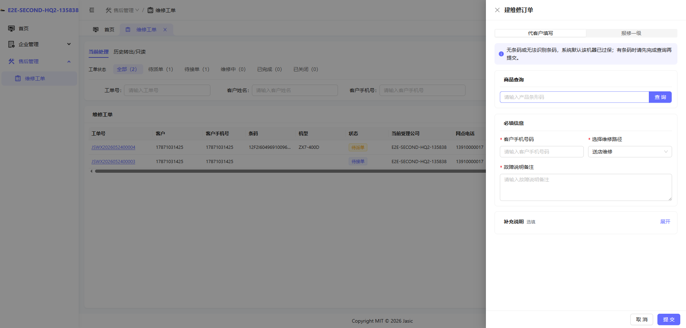
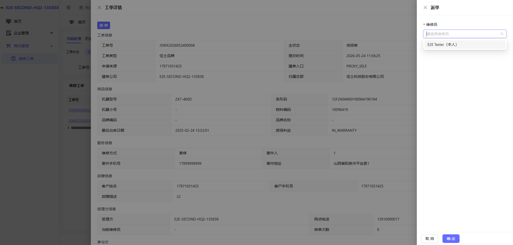
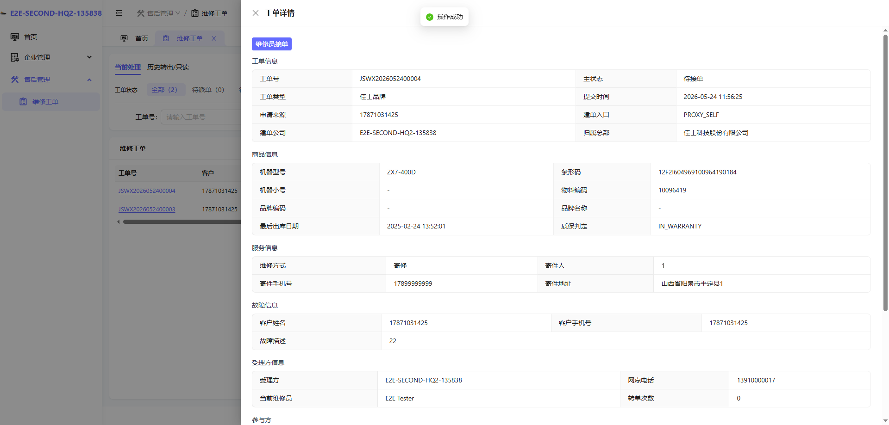

# 二级服务网点管理员操作手册

## 1. 适用对象

适用于二级服务网点管理员账号。

首页截图如下：

## 2. 当前角色定位

二级服务网点管理员当前兼具两类职责：

- 网点侧基础管理。
- 网点侧工单承接与派单入口。

当前可见菜单主要包括：

- 首页
- 企业管理
- 售后管理

展开后当前可见典型页面包括：

- 用户管理
- 角色管理
- 维修工单

## 3. 首页：服务工作台

首页同样是“服务工作台”。

### 使用要点

- 二级网点首页和一级网点首页外观接近，但业务处境不同。
- 二级网点更容易遇到“需要继续转出给上级网点”的场景。

## 4. 维修工单页总览

工单页截图如下：

### 当前可见主要按钮

- 查询
- 重置
- 建维修订单
- 行内派单

这说明在当前环境下，二级网点管理员依然可以承担建单和派单动作。

## 5. 典型操作场景一：创建二级网点本地工单

填写示意如下：

### 操作步骤

1. 进入“维修工单”页面。
2. 点击“建维修订单”。
3. 默认按当前页面要求填写客户手机号码和故障说明备注。
4. 提交后确认无码提示。
5. 提交成功后，确认工单进入“待派单”。

## 6. 典型操作场景二：派单给二级维修员

### 6.1 选择维修员

当前环境里，本次样例工单的维修员选项如下：

### 6.2 派单成功结果

派单成功后，工单会进入“待接单”：

### 操作步骤

1. 在待派单工单上点击“派单”。
2. 选择维修员。
3. 点击“确定”。
4. 确认状态从“待派单”变成“待接单”。

## 7. 二级网点管理员的主要使用价值

该角色非常适合用来讲解以下内容：

- 二级网点如何接入工单处理链。
- 二级网点如何把工单先收进本地承接池。
- 二级网点如何把工单派给本地维修员。

## 8. 关于“转一级网点”的说明

二级网点管理员本身更适合作为“建单与派单角色”来讲。

真正进入“有故障后继续维修登记、再决定是否上转”的动作，通常要切到二级维修员角色继续演示。该部分请结合 [09-二级服务网点维修员操作手册.md](./09-二级服务网点维修员操作手册.md) 一起讲。

## 9. 当前环境提醒

- 二级网点管理员当前具备建单和派单能力。
- 如果当前负责二级网点运营管理，这份手册可优先参考。
