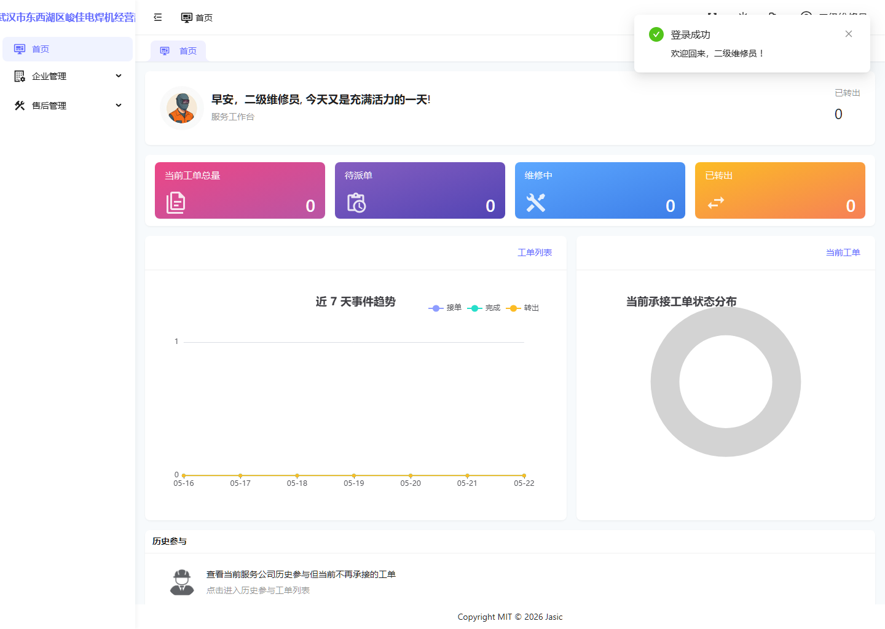
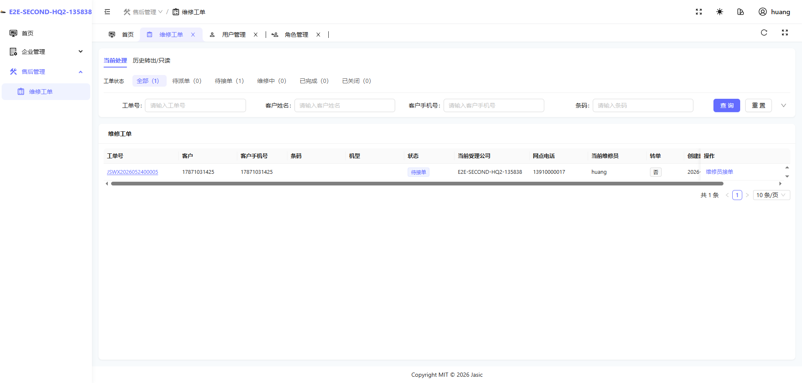
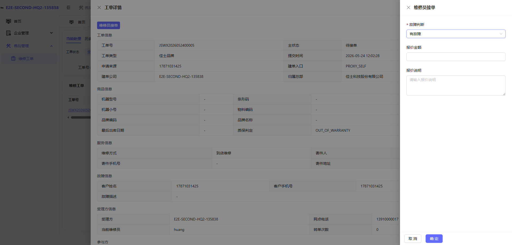
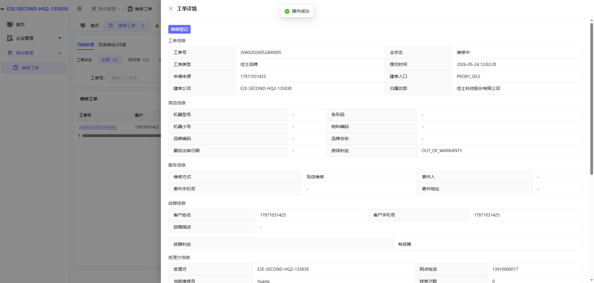
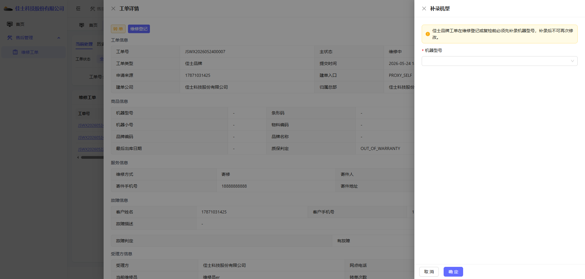
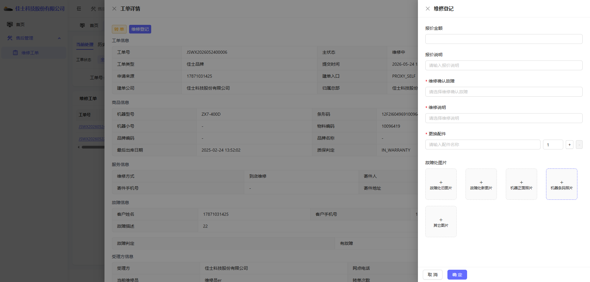

# 二级服务网点维修员操作手册

## 1. 适用对象

适用于二级服务网点维修员账号。

首页截图如下：

## 2. 当前角色定位

二级网点维修员与一级网点维修员同属维修员模板，页面组件与主链路一致，但在业务处境上更常遇到「佳士品牌需先补录机型」等前置条件。

按维修员模板默认能力，二级网点维修员通常可以：

- 查询并查看派给本人的工单。
- 对待接单工单执行「维修员接单」。
- 在「有故障」分支下继续执行「维修登记」（满足补录机型等前置条件后）。
- 在「无故障」分支下，于接单流程内直接完成关闭。

二级网点维修员默认不具备派单、转单、复检、独立关闭已完成工单等管理动作；建单、派单、上转一级网点等通常由二级网点管理员或一级网点承担，实际以账号权限为准。

## 3. 首页：服务工作台

首页标题为「服务工作台」，与一级网点维修员相同。

首页使用重点：

- 如何从首页进入工单处理。
- 如何区分「当前处理」与「历史转出/只读」。

## 4. 当前环境中的工单模块表现

工单页截图如下：

### 当前可见特点

- 有查询、重置按钮。
- 工单派给本人且状态为「待接单」时，会出现「维修员接单」按钮。
- 接单并判定「有故障」后，状态变为「维修中」，出现「维修登记」按钮。

### 注意事项

- 二级网点维修员是否能看到「建维修订单」，取决于账号是否额外具备 `workorder:add`，不以岗位名称推断。
- 佳士品牌、机型缺失的工单，点击「维修登记」时会先进入「补录机型」，这是二级环境中最常见、也最需要提前说明的卡点。

## 5. 典型操作场景一：查看已派给自己的工单

### 操作步骤

1. 进入「维修工单」页面。
2. 在查询区输入客户手机号或工单号。
3. 点击「查询」。
4. 在列表中确认目标工单的当前维修员是否为本人。
5. 若状态为「待接单」，即可进入接单动作。

## 6. 典型操作场景二：维修员接单

「维修员接单」会根据「故障判断」分成两条后续路径：

- 判定为「无故障」：接单与关闭工单在同一次流程里完成。
- 判定为「有故障」：接单后工单进入「维修中」，需继续执行「维修登记」。

以下样例以当前环境已跑通的 **「有故障」** 为主；「无故障」关闭流程与 [07-一级服务网点维修员操作手册.md](./07-一级服务网点维修员操作手册.md) 第 6.3 节一致，此处不重复配图。

### 6.1 打开接单抽屉

点击「维修员接单」后，页面展示右侧接单抽屉（界面与一级/总部维修员相同，下列为二级网点环境截图）。

### 6.2 选择故障判断

当前环境里的可选项包括：

- 有故障
- 无故障

本次样例选择「有故障」：

选择「有故障」后，抽屉内还可选填报价金额、报价说明。

### 6.3 分支一：判定为无故障并完成关闭（简述）

1. 在「故障判断」中选择「无故障」。
2. 点击「确定」，进入「关闭工单」抽屉。
3. 选择返回方式（自提 / 回寄），填写关闭原因；回寄需上传凭证。
4. 提交后工单状态变为「已关闭」。

详细步骤与截图可参考 [07-一级服务网点维修员操作手册.md](./07-一级服务网点维修员操作手册.md) 第 6.3 节。

### 6.4 分支二：判定为有故障并进入维修中

当故障判断选择「有故障」并点击「确定」后，系统直接完成接单，不弹出关闭工单抽屉。

#### 接单后的页面变化

- 工单状态从「待接单」变为「维修中」。
- 「维修员接单」按钮消失。
- 出现「维修登记」按钮。

接单后的列表截图如下：

#### 操作步骤

1. 点击「维修员接单」。
2. 在「故障判断」中选择「有故障」。
3. 如有需要，补充报价金额和报价说明。
4. 点击「确定」完成接单。
5. 返回列表确认工单状态已变为「维修中」。

#### 当前需要理解的边界

- 「有故障」接单只代表进入维修处理，不会在这一步关闭工单。
- 下一步是「维修登记」；若为佳士品牌且缺机型，会先出现补录机型（见第 7.2 节）。

## 7. 典型操作场景三：有故障后的维修登记

本节承接 6.4。只有工单状态为「维修中」，且当前维修员仍是本人时，才会出现「维修登记」按钮。

### 7.1 佳士品牌：补录机型前置（二级环境重点）

在二级网点环境中，佳士品牌、尚未有机型的工单，点击「维修登记」时 **不会直接进入维修登记表单**，而是先弹出补录机型要求。

截图如下：

页面明确提示：

- 佳士品牌工单在维修登记或复检前，必须先补录机器型号。
- 补录后不可再次修改。

#### 操作步骤

1. 在「补录机型」抽屉中选择机器型号。
2. 点击「确定」完成补录。
3. 系统刷新详情后，自动继续打开「维修登记」抽屉。

若归属总部未配置启用机型，页面会提示先维护「故障与维修配置」，此时无法继续登记。

补录机型抽屉示意（补录表单与总部环境同一套组件，下列为总部环境录制）：

### 7.2 打开维修登记抽屉并填写

补录机型（如需要）完成后，进入维修登记抽屉。

维修登记抽屉示意（下列为总部环境录制，字段与二级网点一致）：

当前抽屉内常见字段包括：

- 报价金额、报价说明
- 维修确认故障（若归属总部已配置故障维修项）
- 维修说明、其他维修说明
- 更换配件
- 故障处旧图片 / 故障处新图片 / 机器正面照片

若未配置对应机型的故障维修项，页面退化为填写「维修说明」「更换配件」等基础字段。

当前代码里的关键校验口径如下：

- 「更换配件」至少填写一条有效明细。
- 若存在故障维修配置，需选择「维修确认故障」和「维修说明」。
- 若选择了「其它故障」或「其它维修说明」，对应说明字段必填。
- 若无故障维修配置，则「维修说明」为必填。

#### 操作步骤

1. 确认工单状态为「维修中」，且当前维修员是本人。
2. 点击「维修登记」。
3. 若弹出「补录机型」，先完成机型补录（7.1）。
4. 填写报价、故障项、维修说明、配件和图片等实际信息。
5. 点击「确定」提交。

### 7.3 登记成功后的结果

维修登记成功后，工单状态从「维修中」变为「已完成」。

此时二级网点维修员侧通常会出现：

- 「维修登记」按钮消失。
- 列表可能显示只读提示，例如「当前工单已完成，待复检或关闭」。
- 后续「复检登记」「关闭工单」通常由二级网点管理员等有管理权限的账号处理。

从详情中通常还能看到：

- 故障判定为「有故障」。
- 维修登记时的报价、故障项、配件和图片被完整记录。
- 流转历史含「维修员接单」「报价」「维修登记」等动作。

## 8. 需要特别理解的业务点

### 为什么二级环境要特别强调「补录机型」

- 二级网点承接的佳士品牌工单，在演示数据中更容易遇到「无机型」建单或流转进来的情况。
- 这不是页面故障，而是业务规则：无机型无法匹配故障维修配置，也无法进入正式登记。

### 为什么「有故障」和「无故障」的关闭方式不同

- 「无故障」在接单流程内合并关闭，维修员本人可结束工单。
- 「有故障」须先维修登记到「已完成」，再由管理岗复检或关闭。

### 关于「转一级网点」

- 维修员模板默认 **不包含** `workorder:transfer`，一般不在维修员账号上演示转单。
- 若某账号额外具备转单权限，在「维修中」等状态下可能出现「转单」按钮，目标通常为上级一级网点；具体以页面可选目标公司为准。
- 二级网点 **管理员** 的建单、派单说明见 [08-二级服务网点管理员操作手册.md](./08-二级服务网点管理员操作手册.md)。

### 为什么无故障也会出现「报价」记录

流转历史中可能出现「报价」记录，不代表必须录入金额，详见 [10-常见异常、FAQ 与权限差异.md](./10-常见异常、FAQ 与权限差异.md) 及 [07](./07-一级服务网点维修员操作手册.md) 第 8 节。

## 9. 当前环境提醒

- 二级网点维修员当前最适合演示的主链路：
  - 「接单 → 有故障 →（补录机型）→ 维修登记 → 已完成」
  - 「接单 → 无故障 → 关闭工单」（流程同 07，可选用一级/总部截图）
- 补录机型是二级演示中最常见的卡点，不可跳过。
- 若进入工单页后只看到「返回首页」，优先排查 `workorder:list` 等权限，详见 [10-常见异常、FAQ 与权限差异.md](./10-常见异常、FAQ 与权限差异.md)。
- 7.1 使用二级专属截图；7.1 补录表单、7.2 维修登记暂用总部环境截图（同一套组件），后续可替换为二级账号专属图。
