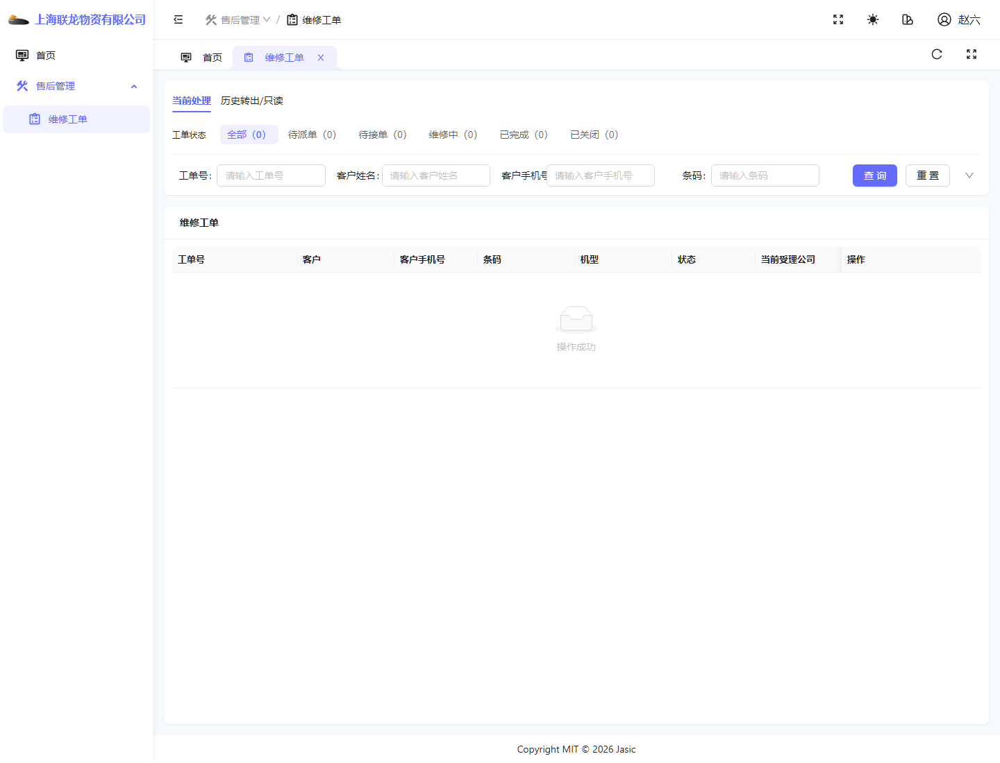
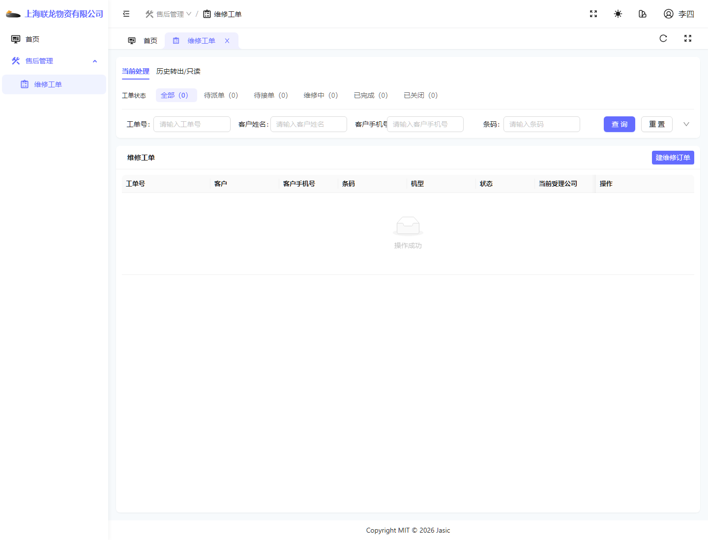
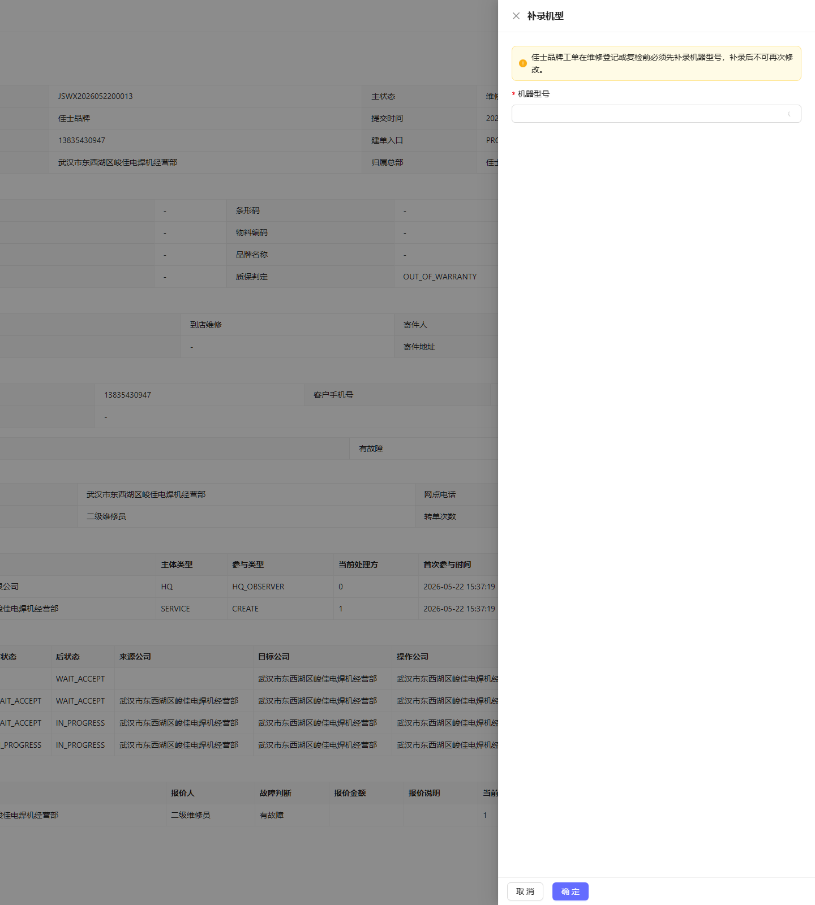
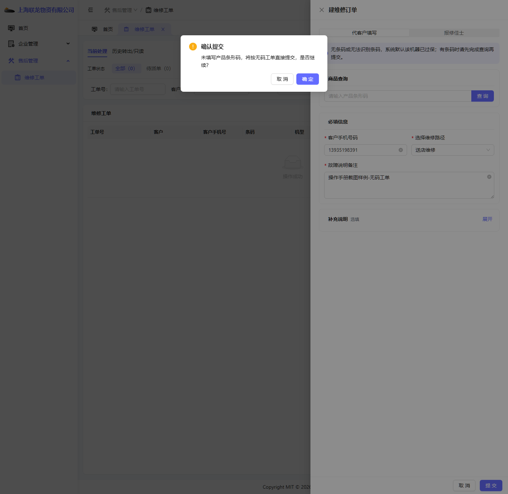

# 常见异常、FAQ 与权限差异

## 1. 文档用途

本文件用于单独沉淀以下内容：

- 常见异常现象
- 常见排查思路
- 当前环境下已经观察到的权限差异
- 最容易被问到的问题

这部分建议在正式使用前优先阅读。

## 2. 常见问题一：为什么能登录首页，却进不了工单模块？

### 当前真实案例

总部维修员账号当前首页可登录，但进入工单模块后页面只显示“返回首页”。

对应截图：

### 常见原因

- 账号本身有效。
- 首页路由可访问。
- 但工单模块菜单或页面权限不完整。

### 说明

“能登录首页”不等于“能进入所有业务模块”。如果工单页只出现‘返回首页’，优先排查角色和菜单授权，而不是先怀疑浏览器故障。

## 3. 常见问题二：为什么派单员当前看不到建单按钮？

### 当前真实案例

一级服务网点派单员账号当前可以进入维修工单页面，但页面上只看到“查询”“重置”等按钮，未看到“建维修订单”。

对应截图：

### 说明

- 当前环境下，本账号更适合作为“查询/查看角色”使用。
- 若业务要求该角色必须建单，应由管理员确认是否需要补齐权限。

## 4. 常见问题三：为什么维修员当前反而能看到建单按钮？

### 当前真实案例

一级服务网点维修员当前页面上除了接单相关能力，还能看到“建维修订单”按钮。

对应截图：

### 说明

- 当前环境里，角色能力不一定完全符合岗位名称直觉。
- 不要用“按名字猜权限”的方式理解，要以当前真实页面为准。

## 5. 常见问题四：为什么工单明明还在系统里，我却在当前处理里查不到？

### 常见原因

- 工单已经转出，不再属于当前受理方。
- 当前账号所在公司只是历史参与方。
- 当前页签停留在“当前处理”，而不是“历史转出/只读”。

### 排查步骤

1. 先确认查询条件是否正确。
2. 再切换到“历史转出/只读”页签查看。
3. 再结合工单详情中的“当前受理方”“流转历史”判断责任归属。

## 6. 常见问题五：为什么二级网点的有故障工单不能继续直接维修登记？

### 当前真实案例

二级维修员把工单接单并判定为“有故障”后，继续点“维修登记”时，系统先要求补录机型。

对应截图：

### 当前页面明确提示

- 佳士品牌工单在维修登记或复检前必须先补录机器型号。
- 补录后不可再次修改。

### 说明

这类情况不是系统卡死，而是业务前置条件未满足。

## 7. 常见问题六：无码工单为什么会弹出确认框？

### 当前真实案例

一级网点管理员建单时，如果没有填写产品条形码，系统会弹出确认提示。

对应截图：

### 说明

- 这表示系统准备按无码工单继续提交。
- 需要了解无码工单的处理口径和风险。

## 8. 常见问题七：派单成功后为什么自己看不到继续处理按钮了？

### 原因

派单成功后，当前维修员已经被指定给别人。

如果当前登录账号不是被派到的维修员，页面通常会变成只读提示，例如：

- 当前由其他维修人员处理

### 说明

这代表权限和处理责任已经切换，不是系统出错。

## 9. 角色差异速查表

以下为本次整理时基于当前环境观察到的典型差异：

| 角色 | 首页可见 | 工单页可见 | 当前重点说明 |
| --- | --- | --- | --- |
| 平台管理员 | 治理看板 | 非主工单角色 | 偏治理、配置、日志 |
| 总部管理员 | 调度看板 | 可进工单，可见建单/派单 | 偏总部调度 |
| 总部维修员 | 可登录首页 | 工单页仅返回首页 | 权限不完整案例 |
| 一级网点管理员 | 服务工作台 | 可建单、可派单 | 适合作为完整入口角色 |
| 一级网点派单员 | 服务工作台 | 可进工单，但当前未见建单按钮 | 权限差异案例 |
| 一级网点维修员 | 服务工作台 | 可接单、可关闭，当前也可见建单按钮 | 适合讲接单关闭 |
| 二级网点管理员 | 服务工作台 | 可建单、可派单 | 适合讲二级入口 |
| 二级网点维修员 | 服务工作台 | 可接单，维修登记前有机型补录前置条件 | 适合讲前置门槛 |

## 10. 页面差异与异常的理解方式

### 页面不一致时

建议先确认当前账号的主体、角色和工单状态。这个系统的按钮和菜单是按角色、主体、状态三层一起控制的。

### 怀疑系统异常时

建议先确认三件事：

1. 你现在登录的是哪个账号？
2. 你现在看到的当前公司和当前角色是什么？
3. 这个工单现在是当前处理还是历史转出/只读？

## 11. 建议的排查顺序

当发现页面或按钮异常时，建议按下面顺序排查：

1. 先确认账号是否登录正确。
2. 先看个人中心里的当前公司和当前角色。
3. 再看左侧是否存在模块菜单。
4. 再看当前页签是否正确。
5. 最后才看是不是页面异常或接口问题。

## 12. 最后提醒

本文件里记录的差异并不是“理论规则”，而是本次在当前运行环境里真实观察到的现状。

如果后续角色权限、菜单授权、工单流程前置条件发生变化，应优先更新本文件，再同步更新各角色操作手册。
